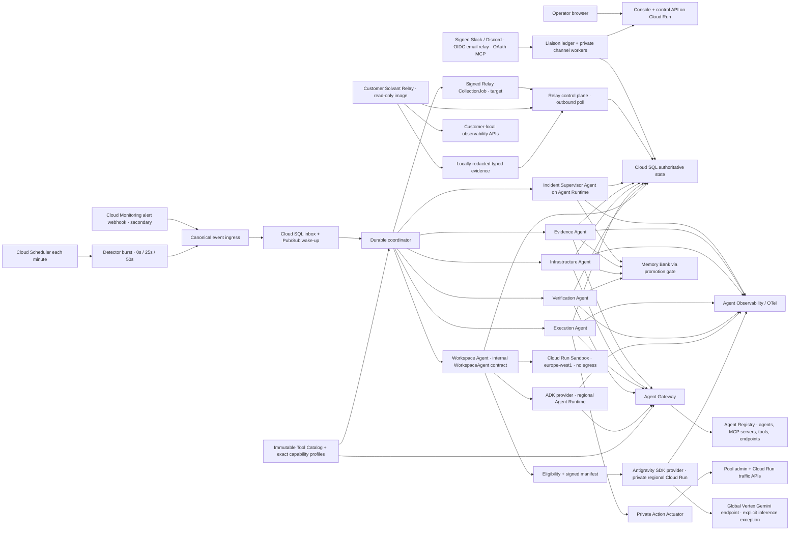
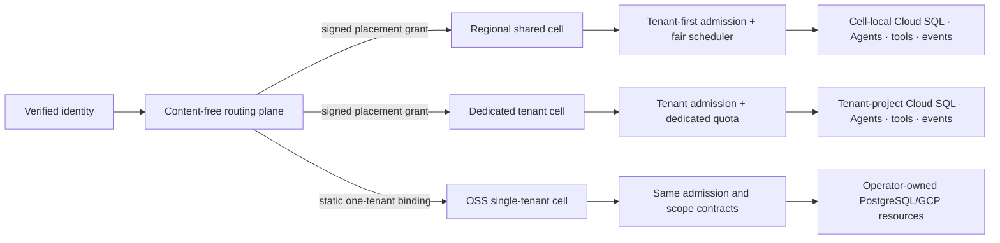

# Solvan architecture map

This is the concise implementation map. Normative behavior is defined in
`specs/`.

The static, submission-ready rendering is
[`docs/assets/architecture.svg`](docs/assets/architecture.svg). It is generated
from the same boundaries described below and contains no live or remote assets.

## Runtime shape

Agent Runtime hosts bounded executions, including jobs of at most seven days.
Cloud SQL owns multi-week workflows, idempotency, approvals, reservations,
schedules, accepted investigation-plan projections, and audit state. Sessions
provide ADK interaction context; Memory Bank supplies scoped non-authoritative
recall. The public Workspace Agent has two implementations behind the internal
`WorkspaceAgent` contract: the
official Antigravity SDK self-hosted on private regional Cloud Run for the
public-synthetic flagship demonstration, and Google ADK plus regional Agent
Runtime for production and Ruhu. Both return proposals; a separate
`europe-west1` Cloud Run Sandbox service produces patch/test truth with no
egress or cloud-data authority. Managed Agents and Agent Engine Code Execution
are not in the execution or rehydration path. Gemini 3.6 Flash fast-fleet
inference uses the documented `eu` multi-region through the jurisdictional
`https://aiplatform.eu.rep.googleapis.com` hostname; only the optional Gemini
3.1 Pro Preview deep workspace uses `global` as an explicit location exception.

The release harness is outside the agent trust boundary. Separate injector and
oracle identities capture healthy baseline, introduce the synthetic fault, and
grade post-action recovery. Agent identities cannot read fixture definitions,
expected diagnoses/actions, oracle logic, or grading results.

The target conversational surface uses one Cloud SQL Liaison ledger across the
console and external channels. Public Slack/Discord ingress verifies native
signatures; email accepts only an audience-bound relay identity; MCP derives its
binding from verified OAuth claims and exposes exactly `ask`, `catch_up`, and
`resolve_ref`. Private workers claim only their own channel kind, freeze
reader-filtered payloads in GCS, recheck binding epoch under a database lock,
and then deliver. No external channel can approve or mutate production.

The target Solvant Relay path is a separate customer-resident read-only product,
not an Agent and not an Actuator mode. It polls outward for one coordinator-
authored signed job, performs one closed catalog read under customer-signed
local policy, redacts before egress, and returns an idempotent evidence
projection. The Agent run binds the real provider source connection and the
coordinator resolves its registered Relay transport; neither is model-selected.
Its executable, identity, image, audience, registry, repository and
IAM contain no mutation capability. Specification 22 governs this target path;
it is not part of the competition release.

## Target production cell shape

The competition deployment above is one cell. The target open-source and
managed product uses the same runtime inside the placement and capacity
boundary defined by
[specification 19](specs/19-saas-scale-and-isolation.md):

An organization has one writable home cell and placement epoch. The routing
plane stores no incident, evidence, transcript, prompt, credential, memory, or
repository content. A capacity failure queues or refuses; it never moves a
request to another tenant, region, model, endpoint, or weaker isolation tier.
Cloud Run scale is bounded by provider quota receipts and the tested database
connection envelope.

## Logical packages

| Area | Responsibility |
|---|---|
| `domain` | identifiers, states, transitions, risk, budgets, verification rules |
| `application` | incident/case use cases, orchestration, durable investigation plans, policy, approvals, memory promotion |
| `persistence` | Cloud SQL repositories, transactions, inbox/outbox, leases, reservations |
| `agents` | catalogued ADK institutional Agents and bounded coordinator-dispatched agent roles |
| `tools` | immutable catalog revisions, exact capability profiles, typed read/compute/mutate contracts, and connector wrappers |
| `platform` | Registry, Runtime, Sessions, Memory Bank, Identity, Gateway, Armor, OTel adapters |
| `connectors` | GCP telemetry/deployment, policy-bound GitHub App, PostgreSQL and synthetic-check adapters |
| `api` | authenticated HTTP/event ingress and console projections |
| `console` | operator UI; never an authorization boundary |
| `benchmarks` | injectors, oracles, evaluators, and immutable evidence receipts |
| `infra` | Terraform, IAM, network, regional placement, deployment and preflight |

Workload-specific topology, signals, operations, and verification journeys are
loaded as adoption profiles. They do not alter the domain or grant permissions
implicitly. [Ruhu's GCP profile](specs/11-ruhu-integration-profile.md) is the
first such contract: observe-only by default, with separately gated
approval-bound and bounded-autonomous phases.

## Dependency policy

Each rule below records whether it is machine-enforced. A rule stated here but
not enforced is a stricter intention than the checker applies, and saying so is
the point: an unenforced rule that reads as enforced is worse than no rule.

1. `domain` imports no Solvan package. *(enforced — ARCH001)*
2. `persistence` depends on `domain`, `application` and database libraries, and
   never on delivery adapters. *(enforced — ARCH001. This previously read
   "`domain` and database libraries only", which no rule has ever applied:
   `config/architecture-rules.yaml` grants `persistence` the `application`
   layer, and roughly 90 such imports exist.)*
3. Agents and delivery adapters call `application`; application code never
   imports the console or HTTP routes. *(enforced — ARCH002)*
4. Connectors cannot update incident or case state directly. *(enforced —
   ARCH001 plus the mutation-root rule)*
5. Only the private Action Actuator can import mutation connectors; the
   Execution Agent may invoke only that actuator with an action ID. *(enforced
   — ARCH003, an AST import check rooted at `apps/actuator`)*
6. Verification does not import remediation planning or mutation connectors.
   *(enforced — ARCH002 on `src/solvan/agents/verification_tools.py` plus
   repository-wide ARCH003. The rule previously keyed on
   `src/solvan/agents/verification`, which is not a directory, so it matched
   zero files and checked nothing.)*
7. Memory promotion consumes confirmed domain events, never raw prompt text.
   *(enforced — ARCH002 forbids `src/solvan/application/memory.py` from
   importing the liaison conversation surface or model routes)*
8. Solvant Relay and the Action Actuator may share audited utility libraries,
   but neither executable may import the other's connector, route, identity or
   repository boundary. *(enforced — ARCH002 in both directions between
   `apps/actuator` and both Relay halves, `apps/relay_control` and the
   customer-resident `apps/solvant_relay`. The rule previously keyed on the
   control plane alone, so the half that actually ships to a customer could
   have imported `apps.actuator` untouched by any check. Customer deployment of
   that image remains target, see specification 22.)*
9. Mutation-connector import rights belong to the actuator composition root
   only. *(enforced — ARCH003 matches `mutation_connector_allowed_roots` on
   path boundaries. It previously used a bare string prefix, which would have
   granted any future `apps/actuator*` sibling directory the same rights.)*

Two limits of this ledger, stated because an unenforced rule that reads as
enforced is worse than no rule. Import rules bound what a *binary* may reach,
not what an *image* ships: `Dockerfile.python` copies the whole `apps` tree and
selects the service through an `APP_MODULE` environment variable, so image
contents and registry separation are an IAM and deployment property rather than
a checked one. And no rule distinguishes composition roots from libraries — a
`composition_roots` key existed in the configuration for some time while no code
read it, and has been removed rather than left to imply a check.

## Verification map

- unit: domain transitions, digests, risk, budgets, target keys, redaction;
- contract: agents, tools, Registry metadata, Gateway policies, event schemas;
- integration: Cloud SQL transactions, inbox/outbox, leases, reservations,
  approvals, plan-before-dispatch, Runtime callbacks, Memory Bank scopes;
- end-to-end: the six competition acceptance scenarios;
- security: negative IAM, bypass, injection, PII, tenant, and region tests;
- release: deployment preflight, isolated baseline/fault/action/oracle receipt,
  live GCP evidence, pool-recycle recovery, and the opt-in fault drill from a clean
  environment.

Cloud deployment uses isolated `europe-west1` `dev`, `staging`, and
`production` environments. `dev` is mutable and never release proof.
`staging` qualifies releases and hosts isolated acceptance drills;
`production` serves declared customer estates and rejects the synthetic fault
drill. All use the shared
`infra/terraform/environments/gcp` stack with separate projects, backend
prefixes, identities, secrets, and data resources.

The GitHub release provider is a private regional Cloud Run boundary. Its
signed webhook ingress, CI-published branch check, coordinator-only PR
operations, independent review/check/head gates, and receipt-backed Cloud SQL
projection are covered by the same scope and audit rules as the rest of the
control plane. It is not a model-facing tool and never performs a generic
`git` push or exposes credentials to the console.
