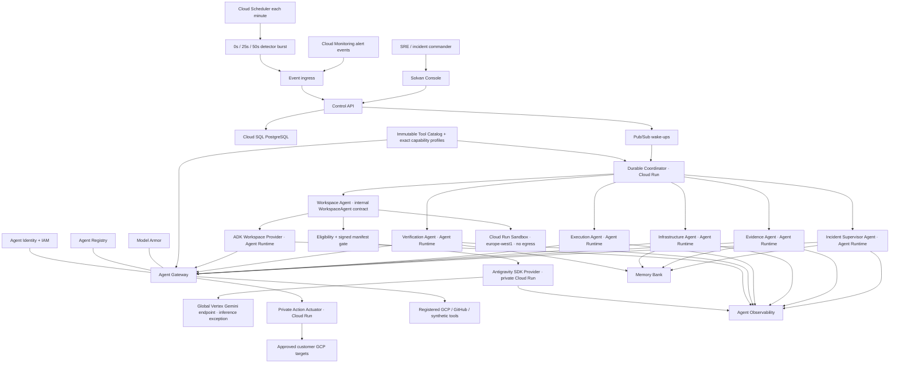

# Solvan system architecture and GEAP integration

Status: required target architecture
Related: [platform sources](../docs/sources/gemini-enterprise-agent-platform.md), [runtime](03-agent-model-runtime.md), [security](05-security-governance.md), [governed Tool Catalog](16-governed-tool-catalog.md), [SaaS scale and isolation](19-saas-scale-and-isolation.md), [production environment model](20-production-environment-model.md)

## 1. Architectural decision

Solvan is a deterministic reliability control plane coordinating bounded
institutional agents. Agent Runtime supplies managed agent execution. Cloud SQL
supplies durable workflow truth. The architecture does not stretch an LLM
conversation into a workflow engine.

## 2. System context



## 3. Deployment units

| Unit | Platform | Responsibility | Mutation authority |
|---|---|---|---|
| Console/API | Cloud Run | UI, authenticated commands, projections, event ingress | no production mutation |
| Coordinator | Cloud Run | inbox/outbox, leases, schedules, Runtime dispatch | no production mutation |
| Incident Supervisor Agent | Agent Runtime + ADK | plan bounded incident/case steps | none |
| Evidence Agent | Agent Runtime + ADK | logs, metrics, traces, prior incidents | read only |
| Infrastructure Agent | Agent Runtime + ADK | versions, deployments, topology, DB capacity | read only |
| Execution Agent | Agent Runtime deterministic custom agent | request execution by stored action ID | invoke actuator only |
| Action Actuator | private Cloud Run service | load `AuthorizedAction`, revalidate, call exact connector, persist receipt | two exact connector methods |
| Verification Agent | Agent Runtime + ADK | fresh telemetry and synthetic verification | read only |
| Workspace Agent (regional provider) | Google ADK + Agent Runtime | production/Ruhu-safe investigation and repair proposal | isolated workspace write only |
| Antigravity Incident Workspace provider | private `europe-west1` Cloud Run + `google-antigravity` SDK + global Vertex inference | flagship synthetic deep investigation, reproduction, patch proposal | isolated public-synthetic workspace only |
| Workspace Sandbox | private `europe-west1` Cloud Run Sandboxes service | execute exact reproduction, patch, and tests with no egress | isolated temporary filesystem only |
| payments fault-drill fixture | Cloud Run + Cloud SQL | opt-in acceptance workload only | n/a |

Execution Agent is an agent for identity, discovery, routing, and telemetry but
contains no planner model. It can invoke only the private Action Actuator with an
action ID. The actuator loads the `AuthorizedAction` from Cloud SQL, validates
current authority, performs one connector call, reconciles the target, and
persists the receipt. Neither the internal agent-role caller nor a browser
supplies a payload.

The product and every machine contract use **Agent** consistently, including
stable keys such as `evidence-agent`. This vocabulary does not grant dispatch
authority: only the coordinator creates and invokes durable Agent runs.
Vendor families such as GKE and AWS are exact capability profiles, not
additional agents or authority silos. Specification 16 owns the naming and
profile contract.

### Target cognition role allocation

The required release fleet remains the fast control lane. The target workspace
architecture in [specification 12](12-workspace-cognition-architecture.md) adds
one logical Incident Workspace as lead investigator and repair implementer. It
may carry cited understanding from forensics through reproduction, patching,
regression testing, and clone pre-validation. It does not detect, authorize,
approve, merge, deploy, actuate, verify production recovery, resolve an
incident, or close a Reliability Case. The coordinator retains ownership and
the Verification Agent remains identity/session/environment-independent.

The flagship implementation embeds the official `google-antigravity` SDK in a
dedicated private regional Cloud Run service. Its compiled agent loop executes
in that container; `vertex=True` routes model calls to exact model
`gemini-3.1-pro-preview` at the Vertex `global` endpoint. Managed Agents is a separate hosted
surface and is not used. Solvan policy restricts the Alpha SDK provider to the
public synthetic competition fixture; regional ADK/Agent Runtime providers fill
the same logical role for production-eligible data.

If enabled for the optional demonstration, the provider is conditionally
published as a seventh Registry entry with experiment-only metadata. The six
required agents, their release checks, and promotion criteria remain unchanged.

## 4. Regional topology

This section is the exact competition topology. The target production product
places the same runtime inside one `OSS_SINGLE_TENANT`, `SHARED_CELL`, or
`DEDICATED_CELL` boundary governed by [specification 19](19-saas-scale-and-isolation.md).
That contract adds identity-derived routing, one writable tenant home,
tenant-first admission, provider quota receipts, bounded SQL pools, and
sovereign lifecycle operations without changing any Agent authority.

Solvan has three normal isolated GCP environment classes in the same approved
region. Dev is mutable engineering and never produces release proof. Staging
qualifies a reviewed release and may host the isolated fault drill.
Production serves declared customer estates. The synthetic payments drill
is an explicit staging/dev feature and Terraform rejects it in production.

Authoritative competition topology:

```yaml
environment: staging
project: <solvan-staging-project-id>
region: europe-west1
regional:
  - Agent Runtime agents
  - Agent Platform Sessions
  - Agent Platform Memory Bank
  - Agent Registry
  - Agent Gateway
  - Model Armor templates
  - Cloud Run control plane and, only when explicitly enabled, the isolated
    payments fault-drill fixture
  - private Antigravity SDK Workspace provider service
  - private Cloud Run Sandbox adjudication service
  - Cloud SQL
  - Pub/Sub and Cloud Scheduler
  - Cloud Storage evidence bucket
model_endpoints:
  fast_fleet:
    location: eu
    endpoint: https://aiplatform.eu.rep.googleapis.com
    model: gemini-3.6-flash
  antigravity_deep_workspace: global # Gemini 3.1 Pro Preview exception
antigravity_sdk:
  package: google-antigravity==0.1.10
  hosting: private Cloud Run
  permitted_data: PUBLIC independently-attested synthetic fixture only
  required_fallback: AdkWorkspaceProvider
```

Invariants:

- Runtime, Gateway, and associated Registry share project and region;
- Model Armor template and Gateway are colocated;
- the fast fleet qualifies exact Gemini 3.6 Flash at the `eu` multi-region and
  the jurisdictional `https://aiplatform.eu.rep.googleapis.com` hostname;
- the exact global Gemini 3.1 Pro Preview endpoint is qualified and shown as an
  Antigravity inference residency exception, never as regional processing;
- the SDK provider has model-invocation and tenant-safe telemetry permission
  only, with no GCS, secret, database, deployment, or production authority;
- no customer, regulated, secret, proprietary, or production data enters the
  optional Alpha SDK path;
- any configured endpoint other than the recorded qualified endpoint fails
  preflight; there is no silent location fallback.

## 5. GEAP responsibility map

| GEAP capability | Native responsibility | Solvan responsibility |
|---|---|---|
| Agent Runtime | deploy, scale, invoke, manage bounded agent jobs | step definition, durable next action, retry classification |
| Sessions | interaction events and ADK context | link session/invocation to case; never use as workflow truth |
| Memory Bank | scoped long-term memory retrieval/generation | candidate policy, redaction, provenance, promotion, safe use |
| Agent Registry | catalog agents, MCP servers, tools, endpoints | release approval metadata, department visibility, conformance |
| Agent Identity | unique principal and cryptographic credentials | least-privilege role design and negative tests |
| Agent Gateway | governed regional routing and policy enforcement | enumerate destinations, no bypass, typed boundary controls |
| Model Armor | covered payload inspection and verdicts | unsupported payload validation, security response, no overclaim |
| Observability | OTel topology, metrics, logs, traces | domain spans, redaction, audit correlation, retention |
| Antigravity SDK | local agent loop, bounded conversation, custom tools/hooks/policies | pin/provenance, task schema, tool ceiling, no durable authority |
| Cloud Run SDK service | regional container lifecycle, IAM-authenticated private HTTPS | stateless requests, least privilege, egress denial, boot/revision receipts |

## 6. Agent topology and protocol

Agents are independently deployable so Agent Registry can expose institutional
capabilities and Agent Identity can apply distinct IAM. Runtime invocation has
one invariant: only the Cloud Run coordinator dispatches agents. A Supervisor
may propose `invoke_agent` steps, but the coordinator validates the plan,
creates the durable `agent_run`, reserves its budget, and invokes that agent.
A2A cards and Registry metadata are for discovery and catalog display in the
competition slice; no Supervisor-to-agent network call is allowed. A callback
is authenticated with workload identity, bound to issuer/audience/nonce, and
its typed body hash is compared with the stored run before consumption.

```yaml
agent_result:
  schema_version: 1
  agent_resource: projects/.../reasoningEngines/evidence-agent-v1
  agent_revision: evidence-agent-20260808-01
  invocation_id: inv-7f3
  incident_id: INC-2041
  workflow_version: 17
  input_scope_hash: sha256:...
  evidence_refs: [EVD-31, EVD-32]
  findings: []
  status: SUCCEEDED
  completed_at: timestamp
  trace_id: 0af...
```

The envelope cannot contain new permissions, tool names, state transitions, or
production actions. Application validation rejects unknown fields for control
purposes.

## 7. Durable execution

### Event path

1. authenticated ingress validates source and canonicalizes event;
2. insert into `inbox_events` using `(source, source_event_id)` uniqueness;
3. transactionally create/update incident/case and append outbox wake-up;
4. outbox publisher sends Pub/Sub message;
5. coordinator acquires entity lease with workflow-version compare-and-set;
6. coordinator creates immutable `agent_run` attempt and invokes Runtime;
7. result callback or reconciler stores typed output and advances state;
8. outbox emits the next event; retries reuse the same logical step key.

Pub/Sub is a wake-up mechanism, not the ledger. Lost or duplicated messages are
reconstructed from Cloud SQL.

Published outbox messages re-enter `inbox_events` with `source='outbox'` and
`source_event_id=outbox_event.id`; the coordinator claims only inbox rows and
due `scheduled_wakeups`, not an undocumented third queue. `workflow_version`
and the live lease owner/token/expiry jointly fence durable state commits; the
token also fences lease renew/release.
Inbox rows, scheduled wake-ups, and outbox rows each use a separate scoped
claim owner/token/expiry. A crashed claimant is reclaimable after expiry, while
a stale token cannot complete or publish another agent's claim.

`agent_runs.status='CREATED'` is also a recoverable lease-like boundary, not an
indefinite prepared state. On every coordinator tick, before selecting fresh
Runtime work, a scope-wide sweep examines deadline-expired `CREATED` rows. A
compare-and-set either adopts a stored provider operation/output receipt or
terminalizes the row as `TIMED_OUT`; two sweepers cannot make two decisions.
Missing provider acknowledgement is recorded as
`DISPATCH_ACCEPTANCE_UNKNOWN`, never inferred to mean that the provider did not
accept the request. The terminal row releases the active-attempt unique-index
fence, while any late output remains fenced by run ID, invocation/input hash,
workflow version, deadline, and terminal status.

Recovery policy remains role-specific. A read-only Supervisor may consume its
one existing replan attempt as an explicitly at-least-once provider execution.
An Execution Agent run with unknown acceptance makes the action `AMBIGUOUS` and
escalates the incident without automatic retry. A Verification Agent run with
unknown acceptance escalates and requires a separately authorized fresh
verification decision. These policies share persistence mechanics but not risk
posture.

### Detection path

The primary demo detector is a Solvan evaluator that runs at 0, 25, and 50
seconds inside one bounded detector burst. Cloud Scheduler starts an
authenticated burst every minute, and the fault drill force-starts that same route
immediately before injection. It executes a typed Cloud Monitoring query from the approved
`detection_rules` version and requires the configured sustained windows before
canonicalizing an event. A real Cloud Monitoring alert policy and authenticated
webhook remain the institutional secondary path. Both sources normalize to:

```text
(rule_id, rule_version, service_id, window_start, window_end,
 observed_value, deduplication_key, severity)
```

`deduplication_key` is `{rule_id}:{service_id}:{deduplication_dimension}` and
contains no timestamp. The partial active-incident index attaches repeat events
to the current incident while allowing a terminal incident to recur later.

Release rules are immutable only after calibration:

| Rule | Signal/query | Evaluation | Threshold |
|---|---|---|---|
| `payments-http-5xx-v1` | Cloud Run request count grouped by 5xx / all responses | 60 s rolling window, every 25 s, 2 consecutive windows | midpoint between recorded healthy maximum and injected-fault minimum |
| `payments-p95-latency-v1` | Cloud Run request latency p95 | 60 s rolling window, every 25 s, 2 consecutive windows | midpoint between recorded healthy maximum and injected-fault minimum |

The build substitutes numeric thresholds from the calibration receipt before
either rule can reach `APPROVED`. Severity is the rule's configured `SEV2`.
Primary source event ID is the hash of rule/version, service, window end, and
aligned sample hash; webhook source event ID is the provider notification ID.

### Runtime job boundary

- foreground agent target: ≤ 15 minutes;
- Workspace Agent repair-task target: ≤ 60 minutes;
- observation wake-ups are separate jobs;
- no case step intentionally approaches the seven-day Runtime maximum;
- provider acknowledgement does not make a prompt deadline provider-enforced;
- acknowledged jobs are cancelled at the Solvan deadline where possible; and
- expiry records a classified Solvan fencing decision and schedules the
  role-specific recovery without claiming provider termination.

### Entity leases

Incidents and Reliability Cases have identical renewable leases. A stale lease
owner may continue computing, but the live token/expiry plus workflow-version
CAS prevents commit. Lease duration is 60 seconds, renewed every 20 seconds;
active connector mutations use their own target reservation and are not made
safe by the entity lease.

The literal inbox/wakeup/outbox claims, incident and case acquire/renew/release,
commit CAS, reservation heartbeat/release, and reaper statements are in
[concurrency.sql](artifacts/concurrency.sql).

### Investigation plan projection

The Supervisor proposes a typed plan, but the coordinator validates and stores
an immutable `investigation_plan` version plus its step projection before any
agent dispatch. Step dependencies form a DAG; cycles, unknown agents,
unregistered capabilities, widened scopes, and budgets above policy are
rejected. Only the coordinator advances projection state from durable events.

The projection is an operational explanation surface, not hidden model
reasoning. It records objective, bounded purpose, dependencies, required versus
optional status, registered agent revision, budget, evidence-count delta,
fallback, and result reference. Replanning supersedes rather than edits the
prior plan. Agent Runtime traces enrich the projection but cannot be its source
of truth.

## 8. Target-level action arbitration

Target key:

```text
{organization}/{project}/{environment}/{resource-kind}/{resource-id}/{mutation-domain}
```

Examples:

- `org-acme/checkout/prod/cloud-run/payments-api/deployment`
- `org-acme/checkout/prod/payments-admin/payments-api/connection-pool`

Protocol:

1. proposal checks current conflicts and records expected target epoch/version;
2. approval wait holds no reservation;
3. execution transaction obtains an exclusive reservation if epoch/version still
   match and increments reservation epoch;
4. reservation TTL derives from connector timeout plus margin; the actuator
   heartbeats the fenced token before and during connector work;
5. agent revalidates policy and approval;
6. mutation occurs with stable idempotency key;
7. agent reads target state until immediate reconciliation is conclusive;
8. receipt commits and reservation releases atomically where possible; expiry
   creates reconciliation work but never releases authority for a competitor;
9. long health verification begins after conclusive release.

Multi-target action keys are sorted bytewise and acquired in that order. Failure
to acquire all releases acquired reservations and performs no mutation.

## 9. Production Graph

The Production Graph is a relational, versioned projection—not an LLM-created
graph. Nodes include service, deployment, database, queue, repository, owner,
SLO, synthetic check, agent, tool, and verification profile. Edges include
`depends_on`, `deployed_as`, `stores_in`, `owned_by`, `verified_by`,
`implemented_by`, and `allowed_to_call`.

Graph changes require source provenance and version. Model hypotheses can cite
candidate edges but cannot commit them. Minimum verification profile bindings
are owned by service policy and cannot be modified in an incident plan.

How that graph becomes current is the target contract in
[specification 20](20-production-environment-model.md): Google's App Topology
API already correlates App Hub, Asset Inventory, Developer Connect, Monitoring,
Security Command Center, and Trace, so Solvan consumes discovery rather than
crawling. Discovery produces `DRAFT` snapshots only, declared and observed
provenance stay distinct, an observed edge can never originate
`allowed_to_call` or `verified_by`, completeness is recorded rather than
assumed, and an approved graph older than its environment's staleness ceiling
refuses autonomous action. The release schema's snapshot tables are unchanged.

Every effective policy/capability projection also records its resolution chain:
the local value, inherited values in precedence order, Registry declaration,
IAM/Gateway enforcement reference, release-manifest snapshot, and final result.
The console renders this chain as structured provenance rather than an editable
raw JSON document.

## 10. Memory architecture

Cloud SQL stores candidates and promotion decisions. Only the promotion service
can invoke Memory Bank generation/create APIs.

Exact scope:

```json
{
  "organization_id": "org-acme",
  "project_id": "checkout-production",
  "environment_id": "prod-europe-west1",
  "purpose": "incident-patterns",
  "classification": "INTERNAL",
  "region": "europe-west1"
}
```

Semantic retrieval uses the direct Agent Platform `memories.retrieve` surface
with bounded similarity parameters because the ADK wrapper discards the managed
resource name and distance required for reconciliation. The returned key/value
set must match all six fields. Every hit then resolves to exactly one current,
unexpired Cloud SQL promotion with the same resource, revision, fact, source
references, classification, region, and purpose. Partial provider iteration is
a total failure. Memory text is wrapped as untrusted historical context and
never mixed with system instructions.

The first consumer is the Evidence Agent. The coordinator mints a short-lived,
audience-bound read grant, performs recall outside the plan-reservation
transaction, and commits the revalidated references and facts into
`agent_runs.input_context_json` plus the recalculated `input_hash` before Runtime
dispatch. An outage or zero authorized hits yields an empty hint list and never
blocks the investigation.

## 11. Observability architecture

Trace hierarchy:

```text
incident.lifecycle
  event.accept
  coordinator.step
    investigation.plan.accept
    investigation.step.transition
    agent.invoke
      model.generate
      tool.call
    policy.evaluate
    approval.validate
    target.reserve
    action.execute
    action.reconcile
    verification.observe
  memory.candidate
  memory.promote
```

Every span includes tenant-safe IDs, environment, incident/case, workflow
version, agent Registry resource, agent revision, policy version, result class,
and latency. Inputs/outputs are hashes or redacted references. The append-only
audit ledger remains authoritative for consequential decisions.

Trace views group calls by durable plan step and agent run. They may show
redacted typed inputs, result summaries, timing, and budget use, but never raw
secrets, unrestricted tool payloads, or private chain-of-thought.

## 12. Failure handling

| Failure | Required response |
|---|---|
| duplicate event | return existing durable result |
| agent timeout/loop | cancel attempt, fence it, retry classified step within budget |
| Runtime unavailable | durable retry wait; console degraded banner |
| Gateway denial | no bypass; security event and blocked/escalated step |
| Memory Bank unavailable | continue without recall; never block safety logic |
| Model Armor unavailable | fail closed for model/tool content paths |
| Antigravity unavailable/ineligible | use ADK fallback; fast lane continues; block only the optional workspace task if no eligible provider exists |
| ambiguous connector result | reconcile read-only; if still unknown, escalate |
| lost outbox publish | republish same event ID |
| changed target during approval | expire proposal and require new plan |
| observation signal missing | verification `INCONCLUSIVE` |

## 13. Technology decisions

- Python 3.12 for control plane and agents;
- Google ADK for the regional fast lane and production/Ruhu Workspace provider;
- the official Antigravity SDK for the public-synthetic flagship Workspace
  provider, self-hosted on private `europe-west1` Cloud Run with qualified
  `gemini-3.1-pro-preview` calls at the Vertex `global` endpoint;
- Cloud Run Sandboxes in `europe-west1` for common no-egress patch/test
  adjudication; Agent Engine Code Execution is not used;
- Agent Platform SDK for Agent Runtime, Sessions, and Memory Bank;
- FastAPI control API on Cloud Run;
- PostgreSQL on Cloud SQL;
- Pub/Sub wake-ups and Cloud Scheduler time events;
- Terraform for infrastructure and IAM;
- TypeScript/React console delivered by Cloud Run;
- OpenTelemetry with Cloud Trace/Logging/Monitoring;
- no Temporal, Celery workflow authority, or OpenAI Agents integration.

Exact versions are lockfile facts and must pass platform compatibility tests;
specification numbers are minimum capability contracts, not floating installs.
