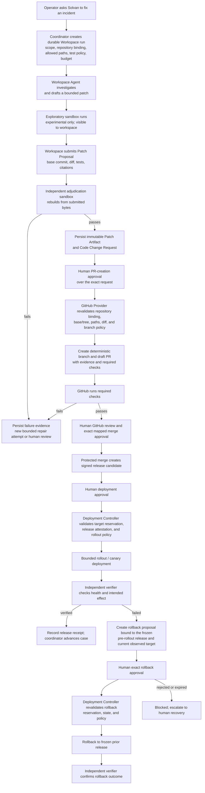

# Solvan implementation and deployment specification

Status: required implementation target
Related: [architecture](02-system-architecture.md), [security](05-security-governance.md), [acceptance](08-test-evaluation-acceptance.md), [SaaS scale and isolation](19-saas-scale-and-isolation.md)

## 1. Scope and baseline

Build only the competition vertical slice described in the product requirements.
Use one Google ADK orchestration path. Temporal is not required: Agent Runtime
provides managed execution and up-to-seven-day jobs, while the Cloud SQL
inbox/outbox/lease design supplies the multi-week durability Solvan needs.

## 2. Repository structure

```text
solvan/
  README.md
  ARCHITECTURE.md
  AGENTS.md
  pyproject.toml
  uv.lock
  package.json
  pnpm-lock.yaml
  apps/
    api/
    coordinator/
    detector/
    actuator/
    antigravity_workspace/
    console/
  src/solvan/
    domain/
      incidents/
      reliability_cases/
      actions/
      verification/
      memory/
    application/
      commands/
      queries/
      policies/
      orchestration/
    persistence/
      repositories/
      migrations/
      inbox_outbox/
    agents/
      supervisor/
      evidence/
      infrastructure/
      execution/
      verification/
      workspace/
        contracts/
        adk_provider/
        lifecycle/
    tools/
    connectors/
      gcp/
      github/
      synthetic/
    platform/
      runtime/
      sessions/
      memory_bank/
      registry/
      identity/
      gateway/
      model_armor/
      observability/
    api/
  infra/
    terraform/
      modules/
      environments/gcp/
  examples/
    payments-stack/
  benchmarks/
    scenarios/
    injector/
    evaluator/
  tests/
    unit/
    contract/
    integration/
    e2e/
    security/
  specs/
  docs/
  scripts/
    bootstrap
    check
    preflight
    deploy
    seed-fault-drill
    run-scenario
    generate-release-evidence
```

## 3. Dependency rules

- `domain` is pure and has no cloud/framework imports;
- `application` depends on domain interfaces, not FastAPI/ADK/SQL clients;
- `persistence`, `connectors`, and `platform` implement application ports;
- only `apps/actuator` imports operational production-mutation connector
  interfaces; the target `apps/deployment_controller` alone may import the
  separate, allowlisted release-deployment connector interfaces;
- Execution Agent can invoke only the actuator and carries no production SDK;
- the target Code Change coordinator may invoke only the GitHub Provider and
  Deployment Controller through their private typed contracts; it carries no
  GitHub App token, repository shell, or deployment SDK;
- the target Workspace code-repair provider may invoke only the three frozen
  `workspace.code-repair.v1` tool adapters; only its sandbox adapter reaches
  the private adjudication service for an identity-derived exploratory run, and
  it carries no GitHub, cloud, deployment, approval, verifier, or production
  mutation connector;
- `agents/verification` cannot import remediation planning or mutation code;
- `api` and ADK entry points are composition roots;
- console types are generated from the versioned OpenAPI contract;
- architecture checks fail imports that violate these boundaries.

## 4. Technology baseline

| Area | Choice |
|---|---|
| language | Python 3.12, TypeScript |
| agent framework | Google ADK |
| optional flagship SDK | `google-antigravity==0.1.13` in private regional Cloud Run |
| managed execution | Gemini Enterprise Agent Runtime |
| application API | FastAPI on Cloud Run |
| console | React + TypeScript, static/server delivery on Cloud Run |
| authoritative DB | PostgreSQL on Cloud SQL |
| wake-ups | Pub/Sub and Cloud Scheduler |
| object evidence | regional Cloud Storage |
| IaC | Terraform for stable core; versioned `gcloud`/API scripts for GEAP resources without reliable provider coverage |
| model | pinned Gemini 3.5+ resource, baseline Gemini 3.5 Flash |
| telemetry | OpenTelemetry to Cloud Trace/Logging/Monitoring |
| package locks | uv and pnpm lockfiles |

Dependencies are exact-locked. A release manifest records resolved package,
model, agent resource, policy, Armor template, and Terraform versions.
The Agent Runtime requirements explicitly pin its serialization transport
dependency (`cloudpickle`) rather than relying on SDK requirement inference.
The deployed private source archive has `solvan/` at its root; deployment
packages the relative directory from the repository's `src` directory and
never embeds an absolute developer or release-snapshot path.
Runtime deployment never supplies platform-reserved environment variables,
including `GOOGLE_CLOUD_PROJECT` and `GOOGLE_CLOUD_LOCATION`; Agent Runtime
injects those values. Solvan-owned routing and policy values use `SOLVAN_*`
names, while the documented Agent Runtime telemetry variables remain explicit.
The general Vertex AI service agent used by the deployment control plane has a
dedicated project role containing only `networkservices.agentGateways.get` and
`networkservices.agentGateways.use`. That control-plane grant is distinct from
the per-agent identity permissions and the Reasoning Engine runtime service
agent's storage and Model Armor grants.

### 4.1 Cloud environment model

Solvan uses three isolated `europe-west1` GCP environment classes:

| Environment | Change policy | Evidence status |
|---|---|---|
| `dev` | mutable experimentation and cloud integration debugging | never release proof |
| `staging` | reviewed release candidates, dry runs, recordings, and submission | authoritative release proof |
| `production` | declared customer estate control plane | operational evidence only; not competition proof |

All environments use the same reusable Terraform root at
`infra/terraform/environments/gcp`, but have separate backend prefixes and
tfvars. They must not share Terraform state, service accounts, secrets, KMS
keys, Cloud SQL instances, buckets, Pub/Sub resources, or Runtime resources.
Terraform workspaces are not the isolation boundary.

Promotion means rebuilding or resolving the reviewed commit in `staging` and
pinning all images by digest; it never means copying dev state. During final
submission dry run and recording, staging is change-frozen except for the
documented release, scenario, rollback, and cleanup procedures. The payments
fault drill is an explicit `fault_drill_enabled` capability of an
isolated dev/staging deployment and is Terraform-forbidden in production.

### 4.2 Direct GCP production-pilot profile — target

`dev` is the first deployed product qualification environment, not a demo
environment. Its production-pilot profile may connect to one Solvan-owned
non-production Google Cloud workload through direct, read-only customer
service-account impersonation and authenticated Cloud Monitoring Pub/Sub
delivery. It must have separate state, identities, KMS keys, Cloud SQL
instance, bucket, Pub/Sub resources, and source-binding records from both
staging and production.

The profile is default-off behind the explicit
`direct_gcp_alert_triage_pilot_enabled` deployment setting.
`target_product_enabled` cannot enable it. When enabled, the allowlist is only
Alert Ingress, API console projections, Coordinator read-only triage,
PilotQualificationVerifier, and their necessary durable services. Relay,
Actuator, channel delivery, fault injection, and unrelated model/Agent
workloads remain disabled. Service identities are separate: Alert Ingress
cannot invoke API or Coordinator, the verifier cannot invoke producer services
or providers, and no service receives a customer mutation role. Direct GCP
onboarding, probe, and alert-source configuration are tested against this
profile before the same mechanism is offered to a customer estate.

Its qualification receipt binds the source commit, image and service revisions,
Solvan and observed external GCP projects, identities, IAM/capability outcome,
region, source-binding epoch, alert-delivery receipt, triage projection, manual
incident-continuation receipt, independent verifier identity/KMS signature, and
expiry. The profile is not production merely because it uses real GCP;
customer-production qualification is a separate receipt in the declared
customer estate.

The complete target acceptance matrix is
[`direct-gcp-pilot-acceptance.yaml`](artifacts/direct-gcp-pilot-acceptance.yaml).
Every entry remains `implementation: null` until its named test and deployed
evidence are both recorded; no pilot profile or release setting may infer a
passing case from a Terraform plan or a successful health endpoint.

## 5. Configuration

Typed settings groups:

```text
deployment: project, region, environment, public URL
database: instance connection, pool, statement/lock timeout
runtime: agent resource names, deadlines, retry schedule
workspace: provider allowlist, SDK Cloud Run audience/URL/revision, request deadline, custom-tool and network-policy hashes
model: resource ID, temperature, token ceilings
platform: registry, gateway, memory bank, armor templates
security: allowed audiences, scopes, classifications, retention
rbac: static principal bindings for OPERATOR, APPROVER, ADMIN
actions: risk policy, budgets, cooldowns, connector endpoints
standing_authority: version, action type, service/incident selector, payload constraints, max attempts, cooldown, validity, approver
verification: profile registry and synthetic target
observability: service names, sampling, content capture disabled
```

Startup validates every setting and exits before serving if a safety-critical
value is absent. Secrets are references resolved through workload identity and
Secret Manager, not `.env` values in deployed containers.

### 5.1 Distributed trace propagation

Trace context is observability metadata only. It never establishes identity,
tenant, scope, authorization, approval, request identity, or idempotency. An
inbound or stored `traceparent` therefore cannot change an application decision.

The shared authenticated Google REST boundary starts a content-free
OpenTelemetry `CLIENT` span for each request and injects the active W3C
`traceparent` and optional `tracestate` into a copied outbound header mapping.
Injection replaces any caller-supplied propagation fields with the active local
context and must not overwrite `Authorization` or other caller headers. The span
may record only the HTTP method, destination scheme/host, response status, and a
bounded local exception class. It never records a URL path or query, request or
response body, credential, prompt/model content, evidence, memory query, private
reasoning, or raw exception message.

This wrapper qualifies only requests made through `authorized_session()`.
Direct `httpx` calls and SDK transports require equivalent shared integration
and tests before their path may be described as propagation-qualified. Stored
trace IDs remain correlation aids and do not substitute for connected spans.

`UT-OTEL-OUTBOUND-PROPAGATION-001` proves parent/child propagation and response
classification. `SEC-OTEL-OUTBOUND-CONTENT-001` proves caller propagation cannot
affect authorization and sensitive request material is absent from spans. A
staging Cloud Trace graph and redaction receipt are required before changing
the status from locally verified to release-qualified.

## 6. Database implementation

- `specs/artifacts/schema.sql` is authoritative DDL and
  `specs/artifacts/concurrency.sql` is the executable concurrency reference;
- the two transition YAML files are loaded at startup and validated against DB
  state enums; code cannot declare alternate transition maps;
- migration tool runs one ordered transaction per safe migration;
- production startup never auto-applies destructive migrations;
- connection pool sets statement, lock, and idle-transaction timeouts;
- the competition process may use the bounded connector defined here, but a
  production cell must use the bounded application pools and pass the exact
  Cloud Run-to-SQL capacity inequality in specification 19 §8; one connection
  per request is not production eligible;
- all commands use transactions and explicit isolation;
- lease/reservation acquisition uses atomic conditional update/insert;
- inbox aggregate update and outbox append share one transaction;
- every repository query includes scope predicates and negative cross-scope
  tests pass;
- every fully scoped table has role-bound row-level security; the bootstrap
  tool grants each workload only its declared table operations and binds its
  Cloud SQL IAM role to one immutable scope;
- mutable projections derive from append-only transitions/receipts and can be
  rebuilt.
- the first migration of a new Cloud SQL cell runs as a separately provisioned
  `postgres` bootstrap administrator whose password is held only in a
  region-bound Secret Manager secret readable by the migration job; workload
  services continue to use scoped Cloud SQL IAM roles, never that password;
  the migration job is the only service allowed to read the secret and the
  operator rotates or revokes it after bootstrap qualification.

Target managed or self-hosted production profiles, multi-tenant routing,
tenant quotas, event sequencing, lifecycle, and capacity qualification are
owned by specification 19 and remain outside this release implementation
target until explicitly promoted.

## 7. ADK implementation

Each Runtime agent package exports one root agent/custom agent and a health/
manifest endpoint. Agent prompts are versioned resources, not inline strings
scattered through nodes. Tools use Pydantic/JSON Schema inputs and typed outputs.

The release deployer binds the Workspace Agent's only private tool-broker URL
and audience to the exact Terraform output for the coordinator service. A
missing, non-HTTPS, or independently supplied broker URL refuses deployment;
the Runtime package never infers this authority from a model argument.

Agent callbacks enforce:

- scope and deadline before agent/model/tool;
- allowlisted tools and call budgets;
- prompt assembly/redaction and Armor result;
- output schema/size;
- OTel attributes and error classification;
- no direct persistent state mutation from callbacks.

## 8. Runtime deployment and versioning

Agents deploy from source or container through supported Agent Platform tooling.
Names include semantic version and build identity. Because native Runtime
revision traffic splitting is Preview and incompatible with Gateway attachment,
the release uses:

1. deploy new immutable agent resource;
2. verify health, identity, Registry entry, Gateway route, and canary eval;
3. update the Solvan release manifest/dispatcher to the new resource;
4. preserve old resource for in-flight runs;
5. deprecate/remove it only after no active references remain.

The catalog release uses one regional Google Cloud Deploy release and two
ordered targets of the same custom target type, as Google requires for one
delivery pipeline. The custom task derives its closed stage from Google's exact
`CLOUD_DEPLOY_TARGET`, never a caller-supplied stage value. `catalog-evaluation`
runs the deterministic catalog and network-policy evaluator under a dedicated
service account. Only a successful evaluation rollout may be promoted to
`catalog-publication`, whose target has `requireApproval=true`. Individual human principals receive
`roles/clouddeploy.approver` on the dedicated catalog delivery pipeline with
Google's `clouddeploy.googleapis.com/rolloutTarget` IAM condition restricted to
the publication target; the build, evaluation, release, migration, Agent, and
Cloud Deploy execution identities receive no approval permission. The
publication action runs only after Google records the rollout as approved.
The dedicated Cloud Deploy execution identity receives Artifact Registry Reader
only on the exact Solvan release repository so Google's custom-task runner can
pull the digest-pinned task image; it receives no artifact write permission.

Every catalog release source contains the exact subject descriptor and the
minimal `skaffold/v4beta7` `Config` required by Google Cloud Deploy for custom
targets whose render and deploy tasks are defined by the registered custom
target type. The release harness creates both files in the same bounded source
directory and invokes release creation before that directory is discarded. It
uses a concise digest-derived release ID, explicitly enables Google's initial
rollout, and verifies before release creation that Cloud Deploy's generated
`<release>-to-<target>-0001` IDs fit Google's 63-character resource-ID limit
for both ordered targets.

The catalog-publication release job receives the exact immutable resource name
for all six Runtime agents together with their evaluated tool bindings. It
independently reads the exact Cloud Deploy release and both rollout resources
before opening a database transaction. It requires the evaluation rollout to
be `SUCCEEDED`, the publication rollout to be `APPROVED`, matching release and
target UIDs, and exact annotations for commit, deployment, catalog-subject, and
network-policy digests. It stores UID-bound Cloud Deploy resource references as
the catalog approval and evaluation references. A caller-supplied URI or string
cannot satisfy this boundary. During the final binding apply, Terraform derives
each binding's `identity_ref` from the same Runtime receipt's system-attested
principal; a pre-deployment placeholder or caller-supplied identity cannot
survive into publication.

Cloud Build provenance and the Google `built-by-cloud-build` Binary
Authorization attestor gate every Cloud Run service and job image independently
of catalog approval. Binary Authorization proves image admission; Cloud Deploy
proves catalog evaluation and human promotion. Neither substitutes for the
other. UID-bound rollout snapshots and the relevant Audit Log entries are
exported to retention-locked regional Cloud Storage as release evidence.
Because `built-by-cloud-build` is a Preview integration, the release harness
independently requires a successful `requestedVerifyOption=VERIFIED` build,
exact provenance coverage for every selected digest, and presence of the
project attestor before it applies the policy or rolls a workload. If the
Preview attestor is absent or unavailable, the tested degradation is to stop
before mutation; exact digest selection and provenance validation remain
independent controls, and no permissive Binary Authorization fallback exists.

The Antigravity SDK provider is not a Runtime or Managed Agents deployment.
Cloud Build resolves the locked Linux wheel by hash, runs import and SDK-agent
construction tests, emits an SBOM/provenance attestation, and builds one
immutable container. Terraform deploys that digest as a private `europe-west1`
Cloud Run service with a dedicated identity, internal ingress, coordinator-only
`run.invoker`, constrained egress, concurrency/timeout ceilings, and minimum
instances zero outside the short recording window. The coordinator pins the
service URL, audience, image digest, and acceptable revision in the release
manifest; a revision not in that manifest cannot satisfy a provider result.

### 8.1 GitHub App release provider

`apps/github_provider` is a separate private regional Cloud Run service. It is
not an ADK agent and it does not receive model output, repository credentials,
or production authority. Secret Manager injects the webhook secret and one
installation token into its dedicated identity; Cloud SQL stores only the
corresponding version references. The release-admin `register-github` job
creates a scoped `PENDING` binding, and the coordinator-only probe is the only
path that can promote it after observing the configured owner/name,
installation, API origin, and default branch at GitHub.

The webhook edge is the sole public Cloud Run route because Cloud Run IAM is
not path-aware: an unauthenticated request is still rejected unless its
`X-Hub-Signature-256` validates against the Secret Manager webhook secret.
Every command route remains coordinator-only and requires a verified Google
ID token with the exact coordinator service-account email.

GitHub delivery and mutation contracts are split. GitHub sends signed
`pull_request` webhooks to `/internal/github/webhooks`; HMAC verification and
delivery-ID deduplication happen before persistence. The repository CI
workflow publishes the candidate `solvan/...` branch and full head SHA. Solvan
reads that ref and refuses a create request if the observed SHA differs from
the reviewed patch command. The coordinator invokes create/sync/merge through
Google ID-token authentication, while the provider writes every operation,
check projection, PR state, and receipt to Cloud SQL. Merge requires the active
repository allowlist, exact `TESTS_PASSED` artifact/review digest, current head
SHA, and passing checks. Solvan never turns a model-authored diff or arbitrary
repository path into a Git push.

### 8.2 Governed code-change and release delivery — `implemented`; production qualification pending

The governed delivery implementation turns an independently tested patch into
a repository review and, only after separate release controls, an immutable
deployment. It is deliberately a separate authority path from the Action
Actuator. Source implementation and local contract evidence do not make a
deployment production-qualified; that status still requires the deployed
`CCR-*` receipts in specification 08.

The exact internal request/response envelopes, caller boundaries, idempotency
keys, closed error classes, and reconciliation rules are normative in
[`code-change-release-private-api.md`](artifacts/code-change-release-private-api.md).
That contract is private: it does not create a browser, Slack, MCP, or model
command surface.



The coordinator creates a `CodeChangeRequest` only after a `TESTS_PASSED`
patch artifact and its fresh independent adjudication receipt agree on the
same immutable submitted bytes. Its repository binding, base commit, permitted
paths, diff digest, test/adjudication receipts, required checks, reviewer and
branch policy, release/deployment policy, and expiry are fixed before any
GitHub mutation. A workspace can create neither this record nor a GitHub
operation; it can only submit its proposed artifact to the coordinator.

The lifecycle is closed:

```text
PATCH_VALIDATED → PR_CREATION_APPROVAL_PENDING → PR_REQUESTED → PR_CREATED
→ CI_PENDING → CI_PASSED | CI_FAILED
CI_FAILED → BLOCKED → ABANDONED | new bounded repair request
CI_PASSED → GITHUB_REVIEW_PENDING → MERGE_APPROVAL_PENDING → MERGED
→ RELEASE_CANDIDATE → DEPLOYMENT_APPROVAL_PENDING → CANARY_DEPLOYING
→ VERIFYING → PROMOTED | VERIFICATION_FAILED
VERIFICATION_FAILED → ROLLBACK_APPROVAL_PENDING → ROLLING_BACK → ROLLED_BACK
ROLLBACK_APPROVAL_PENDING → ROLLBACK_REJECTED | ROLLBACK_EXPIRED | BLOCKED
ROLLING_BACK → ROLLBACK_AMBIGUOUS | BLOCKED
every *_APPROVAL_PENDING state → EXPIRED → BLOCKED → ABANDONED
```

`CI_FAILED`, `EXPIRED`, `ROLLBACK_REJECTED`, and `ROLLBACK_AMBIGUOUS` are
terminal for that request's attempted effect. A coordinator may create one new,
bounded successor repair request with a new base, adjudication, and approval
chain, or an authorized human may append the non-forking terminal
`ABANDONED` transition with a reason. No terminal request is silently revived.

`PR_REQUESTED` is admitted only by a current, exact human `PR_CREATION`
decision. The console has a matching pending decision surface; no target profile
silently treats a patch review, chat message, or policy setting as this
decision. A future standing authority for draft PR creation would require a
separate policy class, risk analysis, and acceptance matrix; it is not
introduced here.

Every positive decision enforces specification 04 §5.1's exact stage role,
fresh step-up authentication, current material revalidation, and immutable
principal attribution before it is written. The same authorized person may
create the request and approve PR creation, merge, deployment, and rollback if
they hold the required current roles. This does not grant the Workspace Agent,
GitHub App, or channel any decision authority, and GitHub review/branch rules
remain independently enforced.

Each stage is an immutable non-forking decision chain. A changed head, check,
rule, target, or policy appends a new material-bound decision that supersedes
the previous leaf; the old decision remains readable but cannot authorize an
effect. The Coordinator, Provider, and Deployment Controller may begin PR
creation, merge, canary, or rollback only when their transition names the
current `APPROVED`, unexpired leaf for its exact stage and their deterministic
service identity. A request or decision expiry admits only the closed
expiry/block/abandon path.

This profile supersedes and removes the CI-published-branch handshake in
specification 04 §10; it is not a compatibility path. Before branch creation
the Provider resolves the registered default
branch and **refuses** with `BASE_STALE` unless its exact commit and tree equal
the request's frozen base commit/tree. It never rebases, amends, retargets to a
moving branch, or accepts a merge-queue rewrite under the old request. A new
base requires a new request, adjudication, and approvals.

The Provider applies only the strict shared transform in specification 04 §5.1,
derives exactly `solvan/ccr/{code_change_request_id}` from the durable request
identifier and no user, workspace, incident, model, or path text, and re-reads
its exact resulting tree hash before opening the draft PR. `solvan/ccr/` is
reserved exclusively for this target path; the current CI seam is forbidden to
publish below it. `CREATE_BRANCH` refuses if that ref already exists at any
SHA, including the expected SHA. It never executes `git`, accepts a
model-selected ref, or writes any path outside the frozen allowlist. The
approved PR-creation command owns three separate durable effect fences:
`CREATE_BRANCH`, `CREATE_PR`, and `MARK_PR_READY`. The Provider creates the PR
as a draft, then uses GitHub's fixed ready-for-review mutation and an
authoritative PR re-read before recording `PR_CREATED`. A crash after any issue
reconciles that exact ref, PR, and draft state; an operator-created collision is
refused rather than adopted.

Merge
requires both an unexpired Solvan `MERGE` decision and GitHub's current
required-review, branch-protection, and check state over the same base, head,
tree, and diff. The Solvan approver must have an active verified mapping to the
GitHub account whose review satisfies the frozen reviewer policy. GitHub is
authoritative for review comments, required reviewers, checks, and branch
rules; Solvan stores their verified projection and refuses to treat its own
review card as a substitute.

The Code Repair Workspace profile unconditionally refuses CI/workflow,
credential, IAM, deployment-manifest, and policy paths. The Provider enforces a
second boundary for every Code Change Request: before `CREATE_PR`, it resolves
the frozen `required_check_definition_paths_hash` and refuses
`REQUIRED_CHECK_DEFINITION_TOUCHED` if the canonical transform changes any path
that contributes to a required check's definition. The request records the
base definition content hash; immediately before merge the Provider re-reads
the same definition paths from both base and head and refuses if either differs
from the frozen base/hash. A future profile that proposes changes to one exact
workflow or release-definition class requires a separately approved path policy,
threat model, check-isolation design, and adversarial acceptance case; it is not
introduced by this profile.

The Provider re-fetches the repository binding, base and head commits, trees,
diff, permitted paths, required-check definitions, installation, rules, mapped
review, and checks
immediately before each create, sync, or merge call. Every external effect uses
the durable `PREPARED → ISSUED → RECONCILING` fence and GitHub-specific
authoritative reconciliation in specification 04 §5.1. No GitHub webhook,
browser, model, or workspace can invoke merge authority.

The protected merge produces a release candidate only after the release policy
verifies an attestation whose subject is the immutable artifact digest and whose
predicate binds the registered repository, exact merge commit and source tree,
approved build-definition ref/hash, builder workload identity, build-invocation
identity, SBOM, and provenance predicate version. It also verifies the release
signature against the registered signer identity and exact key version. A valid
signature over another repository, tree, build definition, workflow, artifact,
or deployment manifest is refused. The immutable deployment manifest itself is
part of the candidate and is bound by reference/hash in its deployment decision.
The Deployment Controller re-verifies these facts rather than trusting a prior
coordinator result, and refuses a signer key version that is currently revoked,
disabled, absent from the registered key registry, or outside the candidate's
signer policy even when its frozen signature verifies.

The Deployment Controller—not the GitHub Provider and not the Action
Actuator—may deploy it. Before the first canary claim it records the observed
predeploy candidate and exact target assignment, then revalidates the exact
`DEPLOYMENT` decision, candidate/provenance/signature, target version and
epoch, target reservation, current rollout policy, predeploy snapshot, rollout
budget, application-derived release-effect descriptor, bound verification
profile, and deployment identity. It deploys only the pinned candidate under a
bounded canary policy. Each canary step and promotion uses the durable external
effect fence; post-issuance recovery reconciles and never calls again. A
deployment is never an incidental side effect of a merge.

The Release Verifier has a distinct identity, process, mutable artifact root,
and declared comparison profile from both Workspace and Deployment Controller.
It compares fresh scoped observations to the predeploy snapshot and frozen
intended-effect descriptor, then writes the only receipt able to mark the
rollout `PROMOTED`. The coordinator, not the verifier, may advance a case after
accepting that receipt. A failed or inconclusive verification cannot be
rewritten as a workspace claim. It creates a rollback proposal bound to the
frozen predeploy candidate/assignment and a fresh target observation; current
traffic rollback still needs a separate exact human approval, as specified in
specification 13. A rejection, expiry, safety failure, or ambiguous rollback
ends in `BLOCKED` and displays the human recovery route. A future standing
preauthorization for a release rollback would require its own action class,
profile, policy, and acceptance tests; it is not introduced by this contract.

The Action Actuator remains responsible only for its typed operational action
catalogue. It never accepts a `CodeChangeRequest`, PR, commit, release
candidate, deployment receipt, or arbitrary deployment operation, and the
Deployment Controller never imports operational mutation connectors. This
separation is enforced by dependency checks, separate identities, audiences,
network policies, registries, and target-reservation namespaces.

### 8.3 First release adapter: GCP Cloud Run revision traffic — `implemented`; production qualification pending

The first production release adapter is fixed as
`gcp-cloud-run-revision-traffic@1`. It deploys one immutable signed release
candidate to one registered Cloud Run v2 Service target. This is an explicit
product boundary, not a generic cloud deployment SDK: GKE, Compute Engine,
Cloud Functions, Cloud Deploy, arbitrary HTTP deployment endpoints, and a
caller-supplied Google Cloud resource are unsupported by this adapter.

The registered target profile contains the exact service resource name,
customer/project scope, location, expected target epoch, runtime service
account, approved deployment-manifest profile, canary percentage sequence,
observation windows, per-rollout deadline, maximum concurrent rollouts, and
verification-profile reference. The Controller receives only a rollout ID. It
reloads that target profile and the release candidate; a request, manifest,
chat message, branch, model output, or GitHub event cannot choose a project,
region, service, revision, traffic split, runtime identity, or observation
window.

The adapter permits only these Cloud Run v2 API operations, all over the
registered Google API endpoint with an OAuth access token minted for the
Deployment Controller's dedicated workload identity:

1. `GET projects/*/locations/*/services/*` to obtain the authoritative current
   service, revision traffic assignment, generation, `etag`, and runtime
   service-account identity.
2. `PATCH` the registered Service with its current `etag` to create the
   candidate revision from the approved, digest-pinned manifest and candidate
   image. The manifest may change only the registered allowlisted template
   fields; it cannot set a new service account, Secret Manager reference,
   VPC connector, ingress setting, IAM policy, environment-secret reference,
   volume, region, service name, or traffic assignment beyond the current
   approved canary step.
3. Poll the named long-running operation and re-read the Service. A canary is
   accepted only when the exact candidate revision and the exact expected
   traffic map are both visible in the authoritative response.
4. Promote by a new `PATCH` with a freshly read `etag` and the next frozen
   traffic percentage. The Controller never skips a policy step or silently
   substitutes 100% traffic for a failed/unavailable observation window.
5. Roll back by a fresh `GET`, a current `etag`, and a `PATCH` that assigns
   100% traffic to the rollout's persisted predeploy revision. It never uses
   “latest”, deletes a revision, changes the template, or infers a prior
   release from current history.

Before issuing each mutation the Controller compares the expected target
version/epoch, service resource, runtime service account, registered manifest
profile, current assignment, candidate artifact/provenance/signature, target
reservation, exact decision digest, policy hash, and operation material hash.
Any difference refuses with a closed precondition code. A Cloud Run long-running
operation timeout, unavailable `GET`, changed `etag`, unexpected revision,
unexpected traffic assignment, or ambiguous operation result becomes
`AMBIGUOUS`/`BLOCKED` and is reconciled by authoritative reads only; it is never
retried as a second deployment mutation. If the provider handle is lost and an
exact read cannot prove the intended state, or a completed provider operation
does not yield that exact state, the operation and private command terminate
`AMBIGUOUS`, the rollout terminates `AMBIGUOUS`, the reservation remains
`RECONCILING`, and the request enters `BLOCKED` (or `ROLLBACK_AMBIGUOUS` during
rollback). Recovery requires an explicit operator path; ordinary dispatch can
never make a second provider call for that operation.

The Controller identity is a distinct service account. Its custom role is
restricted to the registered Cloud Run Services' `get` and `update` operations
and the minimum operation-read permission; it has no Artifact Registry write,
Secret Manager read, IAM policy change, service-account impersonation,
repository, GitHub, Workspace, verifier, or Action Actuator permission. The
runtime service account cannot invoke the Controller. Terraform must prove the
resource-condition binding to the registered service set and deny the same
permissions to Coordinator, GitHub Provider, Workspace, Broker, and Verifier.

The Controller writes a redacted immutable operation receipt containing only
the rollout/operation IDs, target profile hash, candidate revision identifier,
pre/post Service generation and `etag` hashes, expected/observed traffic-map
hashes, Cloud Run operation name, and timestamp. It stores no manifest bytes,
environment values, tokens, secret references, or model content. The Release
Verifier has a separate service identity and only the registered read-only
observation tools; it cannot call this adapter or share the Controller's
artifact root.

Qualification requires a dedicated non-production Cloud Run service first:
stale-etag refusal, target substitution, manifest-field escape, traffic-step
skip, operation replay, ambiguous-operation recovery, rollback lineage,
cross-project/region denial, and Controller/Verifier IAM separation must pass
before an administrator registers a production target. A production rollout
still needs the exact current human deployment or rollback decision; this
adapter does not introduce automatic deployment or automatic rollback.

### 8.4 GitHub reviewer identity broker — `implemented`; production qualification pending

The GitHub Identity Broker implements specification 04 §5.1's GitHub App
user-to-server OAuth link only. It is deployed with a distinct workload
identity, service audience, network policy, and Secret Manager grant for the
GitHub App **client-secret** reference. It may call only GitHub's fixed OAuth
authorization/token endpoints and authenticated current-user endpoint; the
browser reaches its fixed callback through the console origin. It cannot read
the GitHub App private key, mint installation tokens, call repository mutation
endpoints, reach a deployment provider, dispatch an agent, read Cloud SQL
except the scoped read-only repository-binding, role, and session projections
needed to validate a link, or receive external-channel callbacks.

The console initiates the state-and-PKCE web flow; the Broker alone consumes a
callback and exchanges a one-time code. A callback is accepted only when the
authenticated console session, transaction, callback cookie, state, profile,
repository binding, and expiry all match. The Broker uses no dynamic redirect
URI, device flow, user-supplied OAuth client setting, or stored personal token.
It writes only the append-only reviewer-binding authority and audit events.
The GitHub Provider receives a binding ID and verified immutable GitHub account
node ID, never OAuth material, and independently verifies that account's
current required review immediately before a merge. IAM, import-graph,
network-egress, and negative integration tests must prove both directions of
this separation before the target release is eligible.

## 9. Registry and Gateway provisioning

Terraform/application deployment registers:

- six agents (including the provider-neutral Workspace Agent entry);
- every A2A/Agent Card interface as discoverable catalog metadata only;
- every MCP server/tool if used;
- Cloud Logging/Monitoring/Trace read endpoints;
- exact Cloud Run mutation endpoints;
- synthetic check endpoint;
- repository/artifact endpoints.

Gateway policies are generated from the same release manifest as agent tool
allowlists. Drift check compares manifest, Registry, Gateway, IAM, and code
catalog; any extra permission or destination fails release.

The coordinator is the only principal permitted to invoke Runtime agents.
Agent-to-agent invocation is denied and tested even when an A2A card exists.
The optional SDK Registry entry points to the logical Workspace Agent and
records its Cloud Run implementation metadata, but Agent Gateway is not claimed
to route or secure that private endpoint; Cloud Run IAM and the provider network
policy are the enforcement boundaries.

## 10. Model Armor provisioning

Templates are versioned in Terraform/config and deployed in the Gateway region.
An integration probe sends benign, injection, and PII fixtures through every
covered path and stores verdict IDs. Unsupported protocol operations are marked
in the manifest and must have typed-boundary tests.

Model Armor unavailability is fail-closed for model context and governed tool
content. Deterministic health/status reads may continue only if their path
contains no model and passes the typed connector boundary.

The Gateway IAP and inline Model Armor controls have independent Terraform
flags. Staging keeps IAP enabled. While Google rejects the inline
`CONTENT_AUTHZ` policy with server-side code 13, the release workflow sets only
`gateway_model_armor_enabled=false`, retains the Model Armor template and the
in-process fail-closed prompt/response gate, runs its benign/injection/PII
probes, and emits an explicit degraded topology status. This degradation may
complete deployment mechanics but cannot produce a fully release-qualified
receipt.

The shared IAP extension is bound through separate, serially created
`REQUEST_AUTHZ` policies for the egress and ingress Agent Gateways. This follows
Google's documented one-gateway policy shape and prevents a multi-target
preview control-plane operation from coupling the two gateway updates. Release
topology validation requires both exact policy resources before reporting IAP
as enforced.

## 11. Memory Bank implementation

- one regional Memory Bank resource for the demo environment;
- exact organization/project/environment/purpose/classification/region scopes
  plus IAM Conditions;
- only promotion service identity can create/generate/promote;
- agents get retrieve permission only for their allowed purposes;
- source candidates are redacted before Memory Bank ingestion;
- promotion receipt stores resource and revision reference;
- purge deletes scope content and records a non-sensitive tombstone;
- unavailability disables recall/promotion without affecting workflow truth.

The ADK graph pilot and prompt optimizer are not production services, jobs, or
agent registry entries. Production Cloud Run configuration omits
`SOLVAN_ADK_WORKFLOW_PILOT_ENABLED`. Optimizer preparation produces only
digest-addressed, content-free local manifests; any future model-backed run
requires a separate isolated job with no production credentials or deployment
permission and an R-12 qualification receipt.

## 12. Control-plane agents

### Coordinator loop

Runs as an idempotent Cloud Run job/service handler triggered by Pub/Sub and
Scheduler. One tick:

1. claim due inbox/wakeup/step;
2. acquire entity lease;
3. compute legal next command;
4. reserve budget and create agent attempt;
5. invoke Runtime or deterministic service;
6. persist immediate dispatch result;
7. release lease; later callback/reconciler continues.

No handler sleeps through approval or observation windows.
Before step 1 selects new Runtime work, the coordinator scans only its exact
tenant/project/environment for `CREATED` runs whose deadline plus a 60-second
receipt grace has elapsed. Provider checks may occur more than once, but one
status compare-and-set owns the recovery decision. A known operation is checked
and cancelled when its Solvan deadline has elapsed. Unknown acceptance emits a
high-signal structured event/metric keyed by run and agent kind; it contains no
prompt, payload, credential, or provider error text.
Inbox and wake-up claims are token-fenced leases with explicit expiry. A crash
after claim is recovered by the next coordinator only after expiry; stale
claimants cannot complete another agent's row.

### Outbox publisher

Atomically updates unpublished rows selected with `FOR UPDATE SKIP LOCKED` with
a claim token/expiry and increments `publish_attempts`, then publishes the stable
event ID. Success is recorded only by the live token. Expired claims are
reclaimed with bounded backoff; consumer dedupe makes publish-at-least-once safe.

### Lease/reservation reaper

Reclaims expired entity and work-item leases after token checks. An expired
target reservation is never directly released: it creates reconciliation work,
and remains exclusive until a conclusive effect/no-effect receipt exists.
Reservation TTL is the connector timeout plus margin and is renewed before and
during the connector call.

### Detection evaluator

Cloud Scheduler has minute-granularity cron and invokes one authenticated,
bounded detector burst every minute. That handler evaluates at offsets 0, 25,
and 50 seconds, loads one approved rule version, runs only its typed Cloud
Monitoring query, evaluates calibrated windows, and writes a canonical inbox
event. The fault drill force-starts the same Scheduler job immediately before fault
injection. A real Monitoring alert-policy
webhook writes the same shape as a secondary path. It is not used for the
30-second video beat because metric visibility, alignment, and notification
latency are not deterministic.

## 13. Connector implementation

Read connectors:

- construct queries from typed parameters;
- enforce project/resource/time bounds;
- page with total byte/record ceilings;
- normalize and redact before return;
- record request ID, query hash, and source timestamps.

Mutation connectors:

- live only inside the private Action Actuator Cloud Run service;
- accept an action ID from Execution identity and fetch payload from Cloud SQL;
- use provider preconditions/idempotency where available;
- return request ID, not a recovery verdict;
- implement exact read-before/after reconciliation.

The actuator API accepts only the stored action ID plus tenant scope. It
reloads the frozen payload, target, epochs, idempotency key, policy, approval
chain leaf, live approver role, and current workflow/evidence versions. The
payments connector obtains a Google identity token for its registered private
audience, observes pool generation, calls only the bounded recycle operation,
and reconciles read-only before any success receipt.

The rollback connector uses a Google OAuth access token for the Cloud Run v2
API, reads the current single 100%-traffic revision, includes the service
`etag`, and PATCHes only the `traffic` field to the approval-bound known-good
revision. Split traffic, version drift, timeout, or an inconclusive read-back
cannot be reported as success.

Release mutation implementations are exactly:

- `PAYMENTS_POOL_RECYCLE`: call the demo app's private IAM-authenticated admin
  endpoint, which atomically swaps the SQLAlchemy/driver pool, drains old
  connections, returns old/new pool generation, and honors the action
  idempotency key;
- `CLOUD_RUN_TRAFFIC_ROLLBACK`: migrate traffic to the pinned known-good
  revision with revision/etag preconditions, then read traffic state back.

## 14. Demo stack

`payments-api:v2.8.1` contains a bounded, reproducible connection leak activated
by synthetic load. The injector makes real requests and mutates only isolated
demo tenant/account rows with stable idempotency keys. It is authenticated,
unavailable to agents, disabled when idle, and records onset, deployed version,
expected symptoms, row IDs, and cleanup action.

The pre-authorized pool recycle is one real, bounded process-local remediation
with one attempt plus 10-minute cooldown. It intentionally yields partial
recovery because leaked request state continues in the defective revision.
Rollback changes the Cloud Run traffic target to known-good `v2.8.0` through
the exact connector.

Synthetic payment verification uses isolated fake accounts/idempotency keys and
checks both response and database-side no-duplicate invariant.

## 15. Local development

- every Git worktree derives a stable worktree ID, non-overlapping API/console/
  PostgreSQL ports, Compose project, state directory, log/trace directory,
  screenshots, and evaluation artifacts; two worktrees must run concurrently
  without sharing mutable state;
- emulated adapters for Registry/Gateway/Armor/Runtime are explicit fakes and
  cannot be used for release evidence;
- PostgreSQL runs in a local container with migrations;
- recorded synthetic telemetry fixtures support deterministic tests;
- ADK agents run locally against the same schemas and prompt composer;
- `scripts/start` displays a prominent `LOCAL / NO PRODUCTION AUTHORITY` banner;
- the local application exposes content-free structured logs, metrics, and
  traces through `scripts/observe`; the data is worktree-scoped and never
  qualifies as cloud release evidence;
- `scripts/bootstrap`, `scripts/start`, `scripts/stop`, and `scripts/check` are
  the only canonical setup/runtime/verification entry points.

## 16. CI/CD gates

`scripts/check` runs:

1. formatting, type, lint, dependency lock checks;
2. architecture/import rules;
3. migrations from empty and previous schema;
4. unit, contract, integration, security tests;
5. OpenAPI/console type drift;
6. agent manifests and tool schema validation;
7. Terraform fmt/validate/security policy checks;
8. prompt template and evaluation dataset validation;
9. documentation links and requirement traceability.

The architecture gate reads machine-owned dependency directions, forbidden
imports, mutation-connector ownership, structured-logging rules, and file-size
ceilings. Errors name the violated rule and the allowed repair. The documentation
gate validates local links, status metadata, YAML, the full PR range, executable
harness files, and generated repository-map drift.

Cloud release then runs platform preflight, live GCP S1, and deterministic
scripted S2–S6 as defined by the MSR gate.
The release orchestrator injects the full published git SHA and canonical
deployment ID into Terraform-generated variables. Terraform binds those values
to the read-only API together with the evidence bucket, and grants that API
only `roles/storage.objectViewer` on the bucket. The production console
projection hash-validates and release-binds the fixed preflight receipt plus
content-addressed S1–S6 receipts; it never reads a local receipt directory or
accepts an unbound UI status as evidence.
The exact plan-first commands, receipt locations, promotion sequence, and
known-good cleanup procedure are normative in
[the competition release runbook](../docs/release-runbook.md).

## 17. Deployment preflight

Preflight records and verifies:

- competition project and `europe-west1` placement;
- required APIs, quotas, billing, and credits;
- billing budget notifications at $75 and $120 (notification, not a hard cap);
- API, coordinator, actuator, and `payments-api` minimum instances set to 1
  only for dry-run/recording and returned to 0 after; smallest viable Cloud
  SQL tier selected;
- exact fast-fleet model resource at Vertex `eu` through
  `https://aiplatform.eu.rep.googleapis.com`, plus the optional deep
  workspace's exact Pro Preview model at `global` when enabled;
- Runtime agent health and distinct Agent Identities;
- automatic/manual Registry entries and metadata;
- Gateway/Registry association and every expected route;
- direct bypass denial;
- Model Armor templates, explicit inline-gateway enforcement/degradation state,
  and fail-closed in-process protocol coverage probes;
- Memory Bank scope/IAM and regional location;
- OTel trace/log arrival and content-capture settings;
- Cloud SQL migration/schema and backup;
- demo stack versions, synthetic data, injector, and cleanup;
- official `google-antigravity==0.1.13` PyPI provenance attestation, locked hash,
  successful import, and SDK-created local agent/conversation smoke test;
- private `europe-west1` Antigravity SDK Cloud Run service image digest, revision,
  service identity, authenticated coordinator-only invocation, exact global Vertex
  model call, and default-deny ingress/egress and IAM negative probes;
- absence of Managed Agents resources or Agents/Interactions API receipts in
  the SDK path, `PUBLIC` classification plus independent `synthetic=true`
  attestation, logical Incident Workspace role boundary, and regional ADK
  fallback status;
- private `europe-west1` Workspace Sandbox image/revision and no-project-role
  identity, coordinator-only invocation, live `sandboxLauncher: true`, fresh
  nested execution, default-denied egress, request-hash binding, and exact
  artifact-set receipt;

Output is a signed JSON/HTML release artifact. Any safety or rules failure blocks
deployment; Antigravity failure alone marks the optional path unavailable.

When the optional target workspace path is enabled, its manifest declares the
same logical workspace as `Lead investigator` and `Repair implementer` but
contains no capabilities for confirmation, approval, merge, deployment,
production actuation, verification, resolution, closure, memory promotion, or
Production Graph promotion. Preflight negatively probes those absent powers and
proves that the required fast lane operates when the workspace provider is
unavailable.

The canonical migration provisions the two dormant workspace/checkpoint tables.
The enabled optional path also builds a locked, provenance-recorded container
with the pinned official SDK, deploys it as a private regional Cloud Run service,
and provisions a coordinator-owned workspace-specific GCS prefix,
fixture-attester KMS verification,
`PROVIDER_ELIGIBILITY` receipt writer, and an optional seventh Registry entry
marked `ALPHA_SDK` and `EXPERIMENT_ONLY`. The provider identity has regional
Vertex model and tenant-safe telemetry access only: it cannot read GCS/Cloud
SQL/Secret Manager, invoke production services, or mutate infrastructure.
The coordinator materializes exact request content and persists exact results.
Preflight invokes a real task, then creates a new Cloud Run revision from the
same image by changing only a non-authoritative boot-epoch value and invokes the
rehydration task. The proof requires a new service revision and boot hash while
input, artifact, tool-set, network-policy, SDK-distribution, and image hashes
remain unchanged. A Managed Agents or generic model REST receipt without SDK
runtime and Cloud Run provenance does not satisfy the demonstration gate.

Terraform owns the stable network, Cloud Run, SQL, storage, Pub/Sub, Scheduler,
IAM, and policy baseline. Versioned idempotent `gcloud` or REST scripts may own
Agent Runtime, Registry, Gateway, Memory Bank, Armor, or Preview resources when
the provider lacks support. Preflight and the release manifest, not the IaC
engine, prove their final state and detect drift.

If Agent Runtime is not deployable by the end of project Day 2, D-009 applies:
Supervisor runs inside the coordinator while Evidence, Execution, and
Verification remain separately identified private services with identical
schemas and coordinator-only dispatch. This fallback must be labelled accurately
and cannot claim Runtime proof; migration back changes only dispatcher adapters.

## 18. Rollback and disaster recovery

- control plane images are immutable and previous image remains deployable;
- database changes are expand/contract; release rollback does not require data
  rollback;
- agent dispatcher pins immutable resource names and can return to prior agent;
- outbox and run attempts survive deploy rollback;
- Cloud SQL point-in-time recovery is enabled for every production-class
  environment where budget permits;
- `scripts/restore-fault-drill` disables injection and returns the fixture
  service to its known-good revision,
  but does not delete evidence before release capture.

## 19. Definition of implementation complete

The Minimum Submittable Release implementation is complete only when:

- every required API/table/state/tool/agent/UI path exists;
- clean Terraform deployment and bootstrap succeed from documented commands;
- platform preflight passes;
- live GCP S1 and scripted S2–S6 receipts pass against the submitted commit;
- repository README, architecture diagram, test URL/instructions, and licenses
  are accurate;
- the four-minute demo is rehearsed against the same deployed release;
- roadmap capabilities are not represented as implemented.
