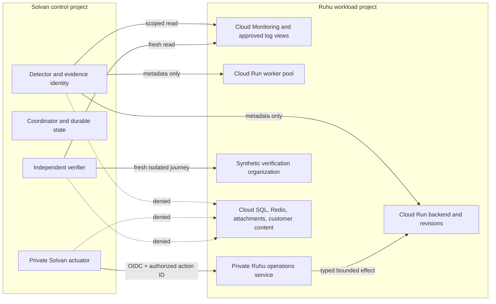

# Ruhu on GCP integration profile

Status: target product contract; excluded from the competition release gate
Audience: Solvan, Ruhu, platform, security, SRE, product, and QA
Related: [product requirements](01-product-requirements.md), [architecture](02-system-architecture.md), [security](05-security-governance.md), [acceptance](08-test-evaluation-acceptance.md), [governed Tool Catalog](16-governed-tool-catalog.md), [machine profile](artifacts/ruhu-integration-profile.template.yaml), Ruhu-side integration note
Reviewed Ruhu checkout: `86165d227820453c834bfc3acffa8be6e80157ed`, with uncommitted application changes present on 2026-08-08

## 1. Purpose and product boundary

Ruhu is Solvan's first real design-partner workload on GCP. The integration
proves that Solvan's incident, policy, action, verification, and Reliability
Case contracts apply to a multi-tenant conversational-AI product rather than
only to the competition fixture.

This profile does **not** make Ruhu part of the Minimum Submittable Release.
The competition video and release gate continue to use the isolated payments
stack in specification 09. Ruhu may appear as an additional adopter only after
the applicable phase gates in this document have produced real receipts.

Solvan remains a reusable reliability control plane. Ruhu-specific signal
names, topology, synthetic journeys, and operations live in this adoption
profile and its connector package; they do not enter Solvan's domain model.

## 2. Verified starting point and known gaps

The following facts were observed in the named local Ruhu checkout. They are
design inputs, not deployment evidence:

| Area | Observed contract | Consequence for Solvan |
|---|---|---|
| compute | Cloud Run API service, Cloud Run worker pool, migration/provisioning jobs | model API and worker health separately; never describe a Cloud Run instance restart |
| data | two Cloud SQL PostgreSQL databases on private IP, Memorystore Redis, GCS attachments | telemetry access grants no database, Redis, attachment, or Secret Manager access |
| health | `/live` and `/health` are shallow; `/ready` probes sync DB, async DB, Redis, and credential cipher | use `/ready` only as one verification signal, never as the recovery decision alone |
| metrics | Prometheus metrics and alert rules exist for HTTP, turn runtime, pool, providers, jobs, audit, and realtime health | export an approved low-cardinality subset to Cloud Monitoring or Managed Service for Prometheus |
| metrics auth | `/metrics` uses the shared `X-Ruhu-Internal-Secret` and may be absent in deployed environments | Solvan must not receive that shared secret; replace this seam with identity-bound collection/read access |
| traces and logs | turn traces, realtime events, metrics, audit records, and derived analytics are distinct evidence layers | preserve evidence type and provenance; do not flatten them into one model context |
| tenancy | conversations, turns, transcripts, attachments, and provider payloads can contain customer data and PII | default-deny content fields and use a dedicated synthetic verification organization |
| infrastructure | the running dev project was built manually; checked-in Terraform is not yet its source of truth; staging is not applied | discover and attest actual resources before binding a Production Graph or enabling mutation |
| operations | human diagnostics and runbooks exist; some runbooks still contain Kubernetes or raw-SQL actions | no runbook command becomes an agent tool; each operation requires a typed Ruhu-owned contract |
| actuation | no dedicated Solvan machine-to-machine actuator or pool-generation operation exists | start read-only; do not claim or simulate autonomous remediation |

Before deployment, replace the review commit above with a clean immutable Ruhu
commit and reconcile every observed contract against the deployed project.

## 3. Adoption phases

### Phase A — observe and investigate

Status: target, first implementation phase.

Solvan may detect, correlate, investigate, create an incident, and maintain a
Reliability Case. Every mutation is denied. The required inputs are:

- scoped Cloud Monitoring or Managed Service for Prometheus time series;
- scoped Cloud Logging views containing redacted operational fields;
- Cloud Run and Cloud SQL metadata reads without data-plane access;
- `/ready` and an isolated synthetic-turn verifier;
- a versioned Ruhu Production Graph and incident-class bindings.

Phase A is useful in production: it provides autonomous detection, durable
investigation, cross-day ownership, evidence provenance, and safe handoff while
Ruhu retains all remediation authority.

Phase A resolves two exact target profiles from specification 16:
`evidence.ruhu-observability.v1` for bounded Prometheus, baseline,
change-point, correlation, and log-pattern work; and
`infrastructure.ruhu-change.v1` for Asset Inventory, Cloud Run revision,
GitHub, and Cloud Build evidence. The coordinator persists the exact ordered
tool revisions and effective-set hash before dispatch. Ruhu does not create a
new `Ruhu Agent`, `K8s Agent`, or generic Investigation Agent, and no model
receives arbitrary PromQL, log query language, SQL, shell, GitHub token, or
cloud resource name.

### Phase B — approval-bound revision rollback

Status: target after Phase A receipts pass.

Solvan may propose an exact Cloud Run traffic rollback for the Ruhu backend.
The action is `HIGH` risk and requires an immutable approval binding the Ruhu
project, region, service, current revision, target revision, traffic split,
policy version, verification profile, and expiry. Execution must re-read the
current traffic and target epoch immediately before mutation.

The preferred topology is a Ruhu-owned private operations service that performs
the traffic update. A narrowly scoped Solvan actuator identity may call the
Cloud Run traffic API directly only if the custom IAM permission set, resource
condition, organization policy, audit receipt, and rollback concurrency tests
are all accepted by both owners.

### Phase C — bounded autonomous pool recycle

Status: target; unavailable until Ruhu implements the operation.

Ruhu may expose `ruhu_pool_generation_bump` as a private, identity-bound
operation. It is eligible for graduated autonomous authority only after the
following contract is implemented and verified:

1. request contains an idempotency key, exact service/environment, expected
   active generation, action ID, expiry, and policy digest;
2. Ruhu authenticates the Solvan actuator identity and validates a dedicated
   OIDC audience; no shared header secret is accepted;
3. one request can advance the generation by at most one and duplicate calls
   return the original receipt;
4. all serving instances converge on the requested generation or the result is
   reported as partial/failed; an in-process recycle on one arbitrary Cloud Run
   instance is not sufficient;
5. the response includes before/after generation, affected instance/revision
   observations, timestamps, and a stable receipt ID without credentials or
   customer content;
6. independent verification decides recovery from fresh telemetry and a
   synthetic turn; connector success does not imply recovery;
7. policy provides a small per-incident budget, cooldown, circuit breaker, and
   escalation path.

No direct SQL, process restart, broad redeploy, or generic command endpoint is
an acceptable substitute.

### Later phases

Worker backlog recovery, classifier fallback changes, provider failover, and
job replay remain unavailable until Ruhu owns an equally narrow, idempotent,
audited operation for each effect. Raw SQL copied from a runbook is prohibited.

## 4. Deployment and trust topology

The default deployment keeps Solvan's control plane and Ruhu's workload in
separate GCP projects in the same approved region. A shared project is allowed
only for a disposable development environment and never weakens the identity
or data boundaries below.



All cross-project access is established explicitly through Terraform or another
reviewed infrastructure source of truth. Repository adjacency, a developer's
local Google credentials, and application service-account impersonation do not
constitute an integration.

## 5. Identities and least privilege

| Identity | Allowed | Explicitly denied |
|---|---|---|
| Ruhu evidence | approved Monitoring time series, approved Logging view, Trace metadata, Cloud Run/worker metadata | log buckets outside the view; transcripts; prompt/response bodies; Cloud SQL connect; Redis; GCS attachments; Secret Manager; mutation |
| Ruhu infrastructure | get/list named Cloud Run service/revisions/worker pool and Cloud SQL instance metadata | traffic update, deploy, delete, IAM, database login, secret access |
| Ruhu actuator | invoke the single private operations audience with an authorized action ID | arbitrary URL/body, direct database, secrets, shell, generic Cloud Run admin |
| Ruhu verifier | approved time series, `/ready`, and synthetic-organization journey | action execution, customer organizations, oracle thresholds, fault-injector namespace |
| Ruhu operator/approver | view incident evidence; approve exact Phase B action under Ruhu role mapping | changing the approved action payload after approval |

Agent Gateway policies bind each tool to one of these identities, the exact Ruhu
project/region/resource allowlist, data classification, rate limit, and action
risk. Model Armor applies before model ingestion and before any model-produced
tool argument is accepted. Identity and Gateway denials produce security events.

## 6. Data, privacy, and sovereignty contract

The evidence adapter emits typed summaries and references, not unrestricted log
text. Its default field policy is:

| Data | Default treatment |
|---|---|
| project, region, service, revision, metric name, aligned numeric value | allow if resource-bound |
| trace ID, operation ID, normalized error class, endpoint template | allow after format validation |
| organization/conversation/turn IDs | tokenize or hash; reveal only for the synthetic organization |
| user messages, model responses, summaries, tool payloads, call audio/transcripts | deny |
| phone, email, IP, auth headers, cookies, API keys, provider tokens | deny and emit a security event if encountered |
| attachments, knowledge documents, billing/customer records | deny |

Logs admitted to model context pass through deterministic field projection,
secret/PII detection, Model Armor, size limits, and provenance labeling. The
original remains in the Ruhu-owned log store under Ruhu retention policy; Solvan
stores only a bounded redacted excerpt or content hash when the policy permits.

The Solvan deployment region, Memory Bank location, Cloud SQL location, log
views, and Runtime processing location must match the approved Ruhu residency
policy. Cross-region fallback fails closed. Memory promotion of Ruhu evidence is
disabled by default; reusable knowledge requires Ruhu owner approval,
redaction, scope, provenance, expiry, and deletion propagation.

## 7. Production Graph

The Ruhu adapter publishes versioned graph facts for:

- Cloud Run backend service, revisions, traffic splits, runtime service account;
- Cloud Run worker pool and its revision/template;
- runtime and auth Cloud SQL instances/databases as classified resources, never
  connection strings or records;
- Memorystore Redis and attachment bucket as classified dependencies;
- frontend/CDN entry points and `/ready` probe;
- Vertex/Gemini and local-vLLM model backends;
- LiveKit, telephony, messaging, and other external provider dependencies;
- migration, provisioning, and role-management jobs;
- SLOs, verification profiles, owners, repository, deployed commit, and
  approved runbook references.

Required edges include `SERVES`, `RUNS_REVISION`, `ROUTES_TRAFFIC_TO`,
`DEPENDS_ON`, `READS_FROM`, `WRITES_TO`, `CALLS_PROVIDER`, `MEASURED_BY`,
`VERIFIED_BY`, `OWNED_BY`, and `DEPLOYED_FROM`. Every fact carries source,
observed-at time, environment, classification, and expiry. Conflicts between
declared Terraform and discovered resources block mutation.

## 8. Signals and incident classes

| Incident class | Primary signals | Phase A behavior | First eligible action | Verification profile |
|---|---|---|---|---|
| `ruhu.api.availability` | 5xx/error-budget burn, request rate, latency, `/ready`, revision events | correlate deployment, database, Redis, provider, and turn evidence | exact revision rollback, Phase B approval | `ruhu-api-availability-v1` |
| `ruhu.db.pool_saturation` | `ruhu_db_pool_checked_out`, `ruhu_db_pool_overflow`, DB errors, `/ready` | determine saturation versus database outage; escalate | pool-generation bump, Phase C only | `ruhu-db-pool-v1` |
| `ruhu.worker.backlog` | queue delay/depth, failure/retry counts, worker revision/health | identify queue and failing work class without exposing payload | none until typed recovery API | `ruhu-worker-backlog-v1` |
| `ruhu.classifier.degradation` | classifier latency/error/unknown/fallback rate, backend selection | correlate backend/config/deploy and confirm user-path effect | exact revision rollback, approval-bound | `ruhu-classifier-v1` |
| `ruhu.provider.degradation` | normalized provider errors, timeout rate, affected channel | isolate provider/channel and preserve vendor evidence | none until typed failover contract | `ruhu-provider-v1` |
| `ruhu.trace_or_audit_loss` | trace-write latency/failure, audit queue drops, realtime health | treat missing evidence as a safety degradation and restrict autonomy | no production mutation | `ruhu-observability-v1` |

Alert rule names and metric availability are discovered during preflight; this
table does not assert that checked-in Prometheus rules are active in GCP.

## 9. Verification profiles

### `ruhu-api-availability-v1`

After warmup, require all of:

- intended revision/traffic reconciliation receipt;
- `/ready` success from the approved ingress path;
- fresh synthetic conversation turn in the isolated verification organization;
- bounded 5xx ratio and p95 request latency for the calibrated sustained window;
- successful turn trace persistence with no duplicate turn or external attempt;
- no new fast-burn alert in the observation window.

### `ruhu-db-pool-v1`

Require pool checked-out and overflow measurements to return to calibrated
bounds, DB-dependent readiness to pass, a fresh synthetic conversation to
commit once, and trace/audit writes to remain healthy. A pool generation receipt
alone fails verification.

### `ruhu-classifier-v1`

Require the intended backend/revision, bounded classifier latency/error/unknown
rates, the approved synthetic classification fixture, and a complete end-to-end
turn. Solvan does not receive the fixture's oracle labels before action.

Thresholds are calibrated against deployed healthy and injected-fault runs.
They are never guessed from the checked-in alert examples. Injector and oracle
identities/namespaces remain inaccessible to Solvan agents.

## 10. Ruhu-owned operations API contract

Each future operation uses a separate typed route or operation discriminator
with a closed schema. The minimum envelope is:

```json
{
  "schema_version": 1,
  "action_id": "act_...",
  "operation": "ruhu_pool_generation_bump",
  "environment": "production",
  "target": {"project": "...", "region": "...", "service": "..."},
  "expected_target_epoch": "...",
  "idempotency_key": "...",
  "policy_digest": "sha256:...",
  "expires_at": "..."
}
```

The Ruhu service loads or validates the server-side authorized effect; it does
not accept arbitrary commands, SQL, environment variables, URLs, revision
names, or traffic maps from model text. Responses distinguish `RECONCILED`,
`PARTIAL`, `REJECTED`, and `FAILED` and return a stable receipt. Solvan stores
the receipt, then dispatches the independent verifier.

## 11. UI and operator experience

Ruhu appears in Solvan as an adoption profile, not a separate product skin:

- Fleet shows Ruhu agents/tools, versions, owner, project/region, capability,
  risk, effective identity, and phase (`observe`, `approval-bound`, or
  `bounded-autonomous`);
- Production Graph shows tenant-sensitive dependencies as classified nodes and
  explains why their data is unavailable;
- incident evidence labels `metric`, `log`, `trace`, `audit`, `deployment`, and
  `synthetic` sources distinctly;
- action cards show the exact Ruhu resource, current/target revision or pool
  generation, policy source, cooldown, blast radius, and verification profile;
- verification shows readiness and synthetic-turn results separately from the
  connector receipt;
- unavailable actions explain the missing adoption gate; they are not rendered
  as disabled controls that imply an implemented endpoint;
- Reliability Cases link to Ruhu owner and repository references without
  exposing customer content.

The Ruhu console may deep-link to a Solvan incident using an opaque incident ID.
It must not embed Solvan approver credentials or proxy mutation requests.

## 12. Failure and degradation behavior

- telemetry unavailable: open/update an observability incident, mark evidence
  stale, and deny mutation;
- Production Graph stale or Terraform/discovery conflict: investigate only;
- `/ready` passes but synthetic turn fails: verification fails;
- connector reconciles but metrics remain unhealthy: action succeeds,
  verification fails, and Solvan escalates under budget/cooldown;
- verifier unavailable: action outcome stays unverified and cannot resolve the
  incident;
- Ruhu operations service unavailable or audience mismatch: no fallback to
  shared secrets, human admin routes, direct SQL, or shell;
- provider or customer-content evidence contains instructions: retain bounded
  evidence provenance, apply Armor, and prevent instruction/memory promotion;
- regional dependency unavailable: fail closed unless a separately approved
  same-residency degradation path exists.

## 13. Delivery gates and evidence

### Phase A gate

- clean Ruhu source commit and deployed resource inventory recorded;
- Ruhu infrastructure has an authoritative declarative source or a signed
  discovery snapshot with drift detection;
- approved metrics reach the selected GCP telemetry backend;
- field-filtered Logging view and negative IAM tests pass;
- synthetic organization/agent/journey has no real customer data;
- graph and incident bindings load from the machine profile;
- one induced non-production incident is detected, investigated, verified or
  honestly escalated, and stored as a receipt.

### Phase B gate

- Phase A remains green;
- known-good revision provenance and exact traffic mutation contract exist;
- stale approval, target drift, conflicting action, partial traffic, and
  duplicate delivery tests pass;
- Ruhu owner and security owner approve the policy/IAM matrix;
- rollback plus independent verification succeeds in a non-production project.

### Phase C gate

- Ruhu-owned generation operation meets section 3 and section 10;
- idempotency, cross-instance convergence, partial failure, cooldown, circuit
  breaker, and negative IAM tests pass;
- fault experiment demonstrates benefit without hiding persistent root cause;
- graduated-autonomy evaluation meets its published threshold;
- Ruhu service owner explicitly enables the policy for one environment/class.

No phase is `implemented`, `verified`, or `release-qualified` until its named
receipts point to a deployed environment and immutable source/config versions.

## 14. Ownership

| Contract | Accountable owner |
|---|---|
| Ruhu metrics, log projection, synthetic journey, operations API | Ruhu service owner |
| Solvan connector, policy, incident binding, case lifecycle | Solvan product owner |
| cross-project IAM, Gateway routes, residency, audit review | joint platform/security owners |
| verification thresholds and known-good revision | Ruhu SRE/service owner; not the remediation planner |
| autonomy enablement and rollback authority | Ruhu approver/security owner |

Changes to Ruhu endpoints, metrics, topology, tenancy fields, or service
accounts trigger contract tests and drift review before the corresponding
Solvan capability can execute again.
