# Solvan Alert Triage

Status: target product contract; excluded from the Minimum Submittable Release
gate. This specification is a design and implementation contract. It does not
claim an alert source, policy, console, channel delivery, or investigation path
is implemented or release-qualified.

Related: [product requirements](01-product-requirements.md),
[architecture](02-system-architecture.md), [data/API](04-data-event-api.md),
[security](05-security-governance.md), [console UI/UX](06-ui-ux.md),
[evaluation](08-test-evaluation-acceptance.md), [tenant integration](13-tenant-integration.md),
[conversational surface](14-conversational-surface.md), [Tool Catalog](16-governed-tool-catalog.md),
and [operational guidance and triggers](17-governed-operational-guidance.md),
[SaaS scale and isolation](19-saas-scale-and-isolation.md), and
[production environment model](20-production-environment-model.md).

Concept inputs: publicly documented alert-investigation, team-knowledge,
channel-delivery, limit, and mitigation-action behaviour in existing
incident-response products, reviewed 2026-08-13. These are product research
inputs, not runtime dependencies, security proofs, or a licence to copy any
other product's implementation or visual expression. Solvan adopts the
operator-facing pattern of a scannable alert queue, an answer-first
investigation report, ordinary anchored follow-up conversation, and one clear
continuation control. It deliberately does not adopt model-selected automation
depth, engagement-derived authority, or in-channel production approval.

## 1. Purpose

An **Alert** is a verified observation from a configured source that may or may
not warrant an Incident. An **Incident** is Solvan's durable production
workflow, with a typed state machine, evidence, action authority, independent
verification, and a Reliability Case. The two records must not be conflated.

Alert Triage gives an on-call team a durable, searchable alert queue and a
bounded first-pass investigation before they open an incident. Its product
promise is:

> Every admitted alert is visibly routed, suppressed, triaged, or escalated;
> no alert lets a model decide authority, mutation, recovery, or closure.

The feature has five jobs:

1. retain verified alert delivery independently of incident creation;
2. normalize and group repeated source alerts without deleting history;
3. apply a human-approved, versioned Alert Triage Policy to decide what work is
   allowed and when;
4. produce an evidence-backed triage report, then deterministically decide
   whether to create/attach an Incident or wait for an operator; and
5. deliver safe status to the console and enrolled channels without treating a
   chat reaction, channel membership, or model output as authority.

## 2. Release boundary

This is target product work. The competition release continues to use its
approved detector and direct qualifying-event-to-incident route. This
specification does not weaken PR-001 or PR-002: for Alert Triage, a
**qualifying alert** is an alert that has passed an approved policy's admission
and escalation conditions. A raw provider delivery alone is never an incident.

The first implementable vertical slice is Cloud Monitoring only, one exact
configured connection, read-only triage, console visibility, and manual
escalation. Other providers, Alertmanager-compatible webhooks, Slack/Discord
delivery, policy authoring UI, and automated escalation follow only after the
foundational invariants and acceptance fixtures pass.

### 2.1 Direct GCP production-pilot qualification — target

The first deployed qualification is one Solvan-owned non-production Google
Cloud estate. It proves the product path before any customer-production claim:

1. the control plane is deployed from a digest-pinned `dev` environment with
   no mutation-capable customer credentials or Actuator permission;
2. one direct `FEDERATED_SHORT_LIVED`,
   `GCP_SERVICE_ACCOUNT_IMPERSONATION` Cloud Monitoring connection has an
   exact external-resource scope, capability receipt, region/classification
   ceiling, and freshness window;
3. one authenticated Pub/Sub push subscription is bound to that exact
   connection, subscription name, push service account, and OIDC audience at
   the dedicated Alert Ingress service; the application accepts no ambient or
   default source;
4. a real provider alert commits an ingress receipt, produces a read-only
   triage projection, and becomes visible in the console; and
5. an authenticated operator manually requests the incident continuation.

The qualification records the deployed control-plane revision, GCP projects,
service identities, source-binding epoch, observed IAM result, alert delivery
receipt, triage result, and expiry in the
[`direct-gcp-pilot-qualification-receipt` schema](artifacts/direct-gcp-pilot-qualification-receipt.schema.json).
A local fixture, Terraform plan, successful HTTP health check, or provider
alert without the complete stored receipt is not production-pilot evidence.
Promotion to a customer-production read path requires a new qualification in
that estate; the pilot is evidence of the product mechanism, not authority over
another customer.

## 3. Non-negotiable decisions

1. **An alert is not evidence of an incident.** It is a source claim. A source
   delivery may be malformed, stale, duplicated, recovered, unauthenticated,
   unmatched, rate-limited, or policy-suppressed.
2. **Ingress receipt and provider semantics are separate.** The adapter first
   verifies source identity, replay window, schema/version, exact connection,
   payload bounds, and deterministic secret/PII rules. It then commits an
   immutable transport delivery receipt and exactly one resulting semantic
   event or refusal/quarantine decision. A raw body is held only in the
   authorized redacted object path; projections, audit, and traces contain safe
   metadata and hashes only.
3. **Policies—not alerts, models, or channel text—define admission.** A policy
   fixes the source selector, source-label mapping, target mapping,
   severity/incident-class mapping, guidance revision, budgets, and escalation
   predicates. The provider payload cannot override any of these.
4. **Triage is read-only.** It may query only the exact pre-resolved frozen Tool
   profile. It cannot invoke the Action Actuator, propose a mutation, approve,
   select a connection, choose a verification profile, resolve, close, or
   promote memory.
5. **"Adaptive" is deterministic.** An Alert Triage Policy may run triage and
   then apply declared application predicates. Historic human engagement or a
   model's confidence may be shown as a non-authoritative tuning signal but
   cannot silently select depth or admission.
6. **Capacity is separated from action authority.** Policy ceilings constrain,
   but never replace, the tenant reservation, workload lane, provider-broker
   reservation, fair scheduler, and settled-usage controls in specification
   19. Neither alert ceiling is the action budget defined by PR-013; action
   limits remain incident-owned.
7. **The coordinator dispatches.** Ingress, policy matching, scheduler, and
   Liaison workers write durable records and inbox work only. No adapter or
   Agent invokes another Agent directly.
8. **Channels notify; the console requests.** In v1 an external channel may
   acknowledge delivery or open a content-minimal console deep link. It cannot
   submit a command, create a mutation approval, execute an action, determine a
   verdict, or change a policy.
9. **Histories are append-only.** A later source recovery, recurrence,
   suppression, re-triage, policy revision, or escalation creates a successor
   record; it never edits the original alert event or triage conclusion.
10. **All scope is derived.** Organization, project, environment, region,
    classification, principal, source connection, and channel binding derive
    from verified identity and stored records, never headers, alert payload,
   URL query fields, or model arguments.
11. **One policy or no work.** Matching produces exactly one approved policy;
    zero matches is `UNMATCHED` and two or more matches is a durable
    `POLICY_CONFLICT` block. Priority, policy-key ordering, policy age, and
    retry timing must never select a winner implicitly.

## 4. Terminology and lifecycle

| Term | Meaning |
|---|---|
| `alert_ingress_delivery` | One immutable authenticated transport attempt; it is not a provider alert transition. |
| `alert_event` | One immutable semantic provider incident/lifecycle observation admitted from a delivery. |
| `alert_episode` | A policy-owned grouping of related alert events for one fingerprint and target. |
| `alert_policy_revision` | One approved, immutable policy that admits, triages, suppresses, or escalates matching events. |
| `alert_triage_run` | A bounded, read-only investigation run for one episode and exact policy revision. |
| `alert_disposition` | The application-owned result of triage: hold, escalate, attach, suppress, or block. |
| `incident_link` | An immutable relation from an episode/disposition to the created or attached Incident. |

An ingress delivery has its own immutable receipt result. An event has one
provider-semantic result. An episode has one current
projection state. A triage run and disposition are immutable append-only
records. A provider's `resolved` indication means only that the provider says
the alert recovered; it is not Solvan recovery verification.

### 4.1 Ingress delivery and semantic event states

```text
transport delivery: RECEIVED -> AUTHENTICATED -> COMMITTED
                                            \-> REFUSED | QUARANTINED
semantic event:    ADMITTED -> NORMALIZED
provider generation policy projection: MATCHED | UNMATCHED | POLICY_CONFLICT
```

`RECEIVED` is in-memory and never a success receipt. `AUTHENTICATED` requires
the exact configured transport proof. `COMMITTED` means the receipt and its
semantic decision are durable in one transaction; only then may the adapter
select an HTTP success response. There is no durable `ACKED` state or broker
acknowledgement receipt: a successful response can be lost before Pub/Sub
observes it, and redelivery is reconciled idempotently. `REFUSED` and
`QUARANTINED` are delivery outcomes and keep only a safe reason code, hash, and
permitted correlation material. An admitted delivery creates one normalized
semantic event with a canonical provider incident key and transition
discriminator. A semantic event never acquires policy state. The provider
generation owns exactly one immutable policy projection: `MATCHED` means
exactly one policy matched and does not mean an Incident exists; `UNMATCHED`
and `POLICY_CONFLICT` are generation outcomes.

### 4.2 Episode state projection

```text
OPEN -> WAITING | TRIAGING | SUPPRESSED | BLOCKED
TRIAGING -> TRIAGED | ESCALATED | ATTACHED | BLOCKED
TRIAGED -> WAITING | TRIAGING | ESCALATED | ATTACHED | EXPIRED
ESCALATED | ATTACHED -> PROVIDER_REPORTED_CLEARED | EXPIRED
```

The projection is derived from immutable records. It is not an authority to
close an Incident. `BLOCKED` requires a safe reason, next owner, and review
time. `PROVIDER_REPORTED_CLEARED` means a verified subsequent source event reports a
clear/recovery condition. `EXPIRED` means the policy-owned retention or
episode-horizon condition elapsed; it never deletes the event history.

An `OPEN` or repeated-open update for an active provider incident updates the
same episode and appends an occurrence. A clear/recovery transition ends only
that generation. A later open after clear or after the configured horizon
creates a successor episode with `recurrence_of_episode_id` and incremented
`episode_generation`; it never reopens or rewrites the former episode or its
Incident link. The policy head/activation that admitted an open episode remains
frozen: head advancement, disablement, or replacement cannot fork or rewrite it.
Its renotification and clear continue that episode; a new head applies only to
a later provider generation or an explicit separately authorized re-triage.

### 4.3 Disposition values

| Disposition | Application-owned meaning |
|---|---|
| `SUPPRESSED` | A declared cooldown, deduplication, pending-cap, or source-recovery rule withheld new triage. |
| `TRIAGED_HOLD` | Read-only triage completed; declared escalation predicates did not pass. |
| `ESCALATED_NEW` | A new Incident was atomically opened. |
| `ESCALATED_ATTACHED` | The episode was atomically attached to the one active matching Incident. |
| `MANUAL_REVIEW` | Policy requires a human decision; no Incident was created automatically. |
| `BLOCKED` | Required connection, target, profile, evidence, policy, or capacity condition failed closed. |

`TRIAGED_HOLD` is not `FALSE_POSITIVE`, healthy, acknowledged, resolved, or a
statement that the alert was unimportant. It must state the evidence window,
the predicates evaluated, and the next review/expiry condition.

## 5. End-to-end processing

### 5.2 Connection-bound local detection

An approved polling detection rule names `source_connection_id` and
`source_connection_epoch`. Before every observation, the detector resolves that
exact row and refuses unless it is `GCP_NATIVE`, `CLOUD_MONITORING`,
`GCP_SERVICE_ACCOUNT_IMPERSONATION`, `ENABLED`, and `READY`; its epoch,
classification, external project and workload region must still match the
rule's frozen material. The detector never takes a project, reader identity or
connection from a launcher argument, process-wide default, request field, or
model output.

The detector sends the closed signal kind, resource selector, time window and
resolved connection binding to the Direct GCP Reader. The reader constructs the
Google request from that typed material, uses the exact recorded delegation,
and returns only the scalar observation, provider request IDs and verified
resource attribution. Raw provider payloads do not cross the reader boundary.
The detector binds those fields and the connection ID/epoch into the immutable
evaluation receipt before the existing sustained-window and Incident admission
logic runs.

Local-connected scheduling may run this path on a workstation, but it uses the
same database rules and Incident state machine and remains visibly
non-authoritative. An unbound legacy rule is not evaluated. Missing or stale
connection material is not a zero metric and cannot advance a streak.

The local UI runner is synchronous and bounded: one authenticated request asks
the separate detector for one current evaluation slot, claims at most twenty
durable inbox rows, and applies the ordinary coordinator claim handler. It does
not run downstream investigation Agents or publish the Incident outbox. A
repeated request in the same slot is idempotent at the evaluation key; it may
report zero new events while still proving that the real read completed.

```mermaid
flowchart LR
  A[Authenticated transport delivery] --> B[Immutable ingress receipt]
  B --> C[Semantic alert event]
  C --> D[Policy-neutral provider generation]
  D --> E[Approved policy matching + target mapping]
  E -->|unmatched or conflict| F[Safe generation outcome + console]
  E -->|one match| G[Policy fingerprint + episode]
  G -->|suppressed or blocked| F
  G -->|triage allowed| H[Coordinator inbox]
  H --> I[Read-only triage run]
  I --> J[Predicate evaluation]
  J -->|hold| F
  J -->|escalate| K[Open or attach Incident]
  K --> L[Normal Solvan incident workflow]
  F --> M[Optional Liaison notification]
  L --> M
```



1. A provider-specific adapter authenticates, validates, redacts, and stores
   one `alert_ingress_delivery` idempotently by its exact transport identity.
   For Cloud Monitoring Pub/Sub push, that identity is `(scope triple,
   connection_id, connection_epoch, subscription_name, pubsub_message_id)`.
   Every HTTP receipt attempt appends `alert_ingress_receive_attempt`; the
   immutable delivery is not mutated with a receive counter. It commits the
   receipt, refusal, or semantic decision before selecting an HTTP success
   response, which is not proof of broker acknowledgement. A connection epoch
   rotation makes a delivery from the old epoch ineligible for new work and
   records `CONNECTION_EPOCH_STALE`. An epoch successor can contribute to the
   same semantic source only when the append-only
   `alert_provider_source_epoch_membership` ledger records a fenced continuity
   decision from the predecessor to successor with the same scoped provider,
   source configuration, scoping project, topic/subscription binding, and schema.
   The stable `alert_provider_source_identity` is never edited; repeated A→B→C
   rotations append memberships under a strictly increasing continuity epoch.
   Otherwise the successor creates a distinct identity and cannot deduplicate
   prior incidents. The deterministic Connection Lifecycle Service records the
   attestation before successor ingress; neither a provider payload, model, nor
   alert-policy revision may assert semantic continuity.
2. The application admits a semantic `alert_event` only from a committed
   delivery, with provider incident/lifecycle identity, canonical transition
   discriminator/sequence, observed time, and a delivery reference. It then
   canonicalizes a closed normalized schema and records/locks a policy-neutral
   `alert_provider_generation`. A generation contains no policy fingerprint,
   target, severity, episode, or admission.

For Cloud Monitoring schema version 1.2, `provider_incident_key` is the
provider `incident_id`. The canonical transition discriminator is
`OPEN:<started_at>` for an open incident and
`CLOSED:<started_at>:<ended_at>` for a cleared incident; all three operands are
required, normalized timestamps. A subsequent delivery with the same key and
discriminator is a renotification: it references the existing semantic event
and appends an immutable provider-generation occurrence. If an active episode
was already attached under one unique match, it also appends that episode's
occurrence. It creates no new transition, admission, or triage run. A later
open with a new `started_at` is a new semantic
transition and follows the recurrence rule in §4.2. Missing or unparsable
transition material is `TRANSITION_KEY_INCOMPLETE` and creates no semantic
event.

The connection capability/configuration receipt binds the Monitoring
`scoping_project_id`; the normalized payload must report the same
`incident.scoping_project_id`. Target mapping separately extracts the monitored
resource project from the closed `incident.resource.labels.project_id`. That
resource project—not the scoping project—must match the frozen Production Graph
node, current environment binding, and current `METRIC_READ` coverage receipt.
Missing, conflicting, or cross-scope values block. Both project identities are
immutable provenance and neither falls back to the other.

Cloud Monitoring push ordering is not assumed. The application serializes the
provider generation `(provider_source_identity_id, provider_incident_key,
started_at)` under a database lock and projects by normalized event time/state,
not arrival order. A valid `CLOSED` transition for that generation dominates
open or renotify: close-first is retained as a reconciled cleared generation;
a late open/renotify with the same `started_at` is historical and cannot reopen,
admit, or triage it. Only a later `OPEN` with a different `started_at` creates a
recurrence successor. Pub/Sub ordering keys are neither required nor treated as
proof of lifecycle order.
3. The policy matcher evaluates only the current activated head of each policy
   key under specification 17 for the exact source Tool revision, registered
   Agent, verified identity, capability class, connection/epoch, scope,
   accepted classification, and region. Once each candidate maps the exact
   event target, matching additionally proves that target's current Graph node,
   environment authorization binding, and target-project coverage. It
   records every candidate and reason for non-match, including each candidate's
   independent target mapping, but creates no episode while doing so. It permits
   work only if exactly one candidate matched. Zero creates a policy-neutral
   generation `UNMATCHED` outcome; multiple candidates create a policy-neutral
   `POLICY_CONFLICT` outcome, and neither selects a target, fingerprint, episode,
   triage, retry, or escalation work. The generation policy projection is final:
   a later policy-head change, retry, or renotification cannot rematch it.
   Only a separately specified future generation-rematch authority could change
   this rule; v1 defines no such command.
4. Only the exact one matching policy may compute its policy-defined fingerprint
   using the stable provider-source-binding ID and mapped target, then atomically
   create or attach the target-keyed `alert_episode` and record an immutable
   admission/suppression decision.
   `LATEST_WAITING_PER_TARGET` may supersede an older waiting triage request;
   an older sequence arriving after the current waiting request is explicitly
   suppressed as `STALE_SOURCE_SEQUENCE`,
   never a claimed, running, completed, or incident-linked run.
5. A fenced scheduler claim revalidates policy lifecycle/digest, connection
   availability and epoch, target graph snapshot and placement, classification/
   region, episode state, cooldown, policy ceiling, tenant reservation,
   workload lane, provider-broker reservation, and capacity receipt. It uses
   the existing inbox/outbox/wake-up/lease/retry/quarantine state machine, not
   a second alert worker state machine, and enqueues coordinator work in the
   same transaction.
6. The coordinator creates a durable triage plan and `agent_run` before it
   dispatches the read-only triage role. Its frozen profile excludes all
   mutation, approval, and verification Tools.
7. The application evaluates declared predicates only against committed source,
   evidence, and application-derived fact records. A model report, verdict,
   confidence, hypothesis label, prose, or unverified report field cannot set a
   disposition or become a predicate input.
8. If escalation passes, `open_or_attach_incident` runs under the existing
   incident deduplication lock. It creates one `incident_link` and then starts
   the normal Incident Supervisor workflow. A triage run cannot itself select
   an action, policy, verification profile, or mutation.
9. The console and Liaison project only committed records. Retry and delivery
   failures are visible, fenced, and do not rerun triage or escalation.

### 5.1 Required fence revalidation

Every authorization-sensitive transition revalidates the current scope, cell,
placement epoch, connection epoch, policy hash/lifecycle, graph snapshot/target
version, classification/region, and any named reservation. The required gate
set is closed, not advisory:

| Transition | Additional required gates | Failure |
|---|---|---|
| policy match/admission | exact semantic event, one-match rule, connection capability, graph mapping | durable safe outcome; no work |
| scheduler claim | existing lease/fencing token, row version, central reservations and lane | release/settle reservation; queue or block |
| coordinator dispatch | persisted plan, exact evidence-agent profile, agent request hash | no dispatch |
| accepted agent result | request ID/hash, workspace generation, profile, plan, and all fences | retain rejected result as untrusted history; no predicate evaluation |
| predicate evaluation | AST/version, committed input references, current fences | declared inconclusive outcome |
| incident link | existing incident lock/deduplication plus all fences | no link/supervisor dispatch |
| Liaison delivery | current audience, channel binding/revocation, cell/placement and payload hash | no delivery or retry by existing delivery state machine |

An attempt that becomes stale at any later gate is historical evidence only. It
cannot obtain a new lease, dispatch a successor, escalate, link an Incident, or
deliver a notification.

## 6. Policy contract

`alert_policy_revision` is a specialization of the governed trigger-policy
contract in specification 17. It must reuse that policy lifecycle, evaluator,
approver separation, scope checks, connection health/epoch fencing, scheduled
wake-up discipline, immutable audit, and supersession protections. It must not
be represented as untyped JSON added to a connection.

It is a typed subtype of the specification 17 trigger-policy record, not a
parallel policy authority: its immutable revision lifecycle is exactly `DRAFT`
or `APPROVED`, and it uses the same evaluator/approver/activation
and current-head trigger-lifetime rules. `IN_REVIEW` is not an alert-policy
lifecycle state. Approval alone does not match an alert: the matcher considers
only the one current activated head per policy key, freezes its activation ID
and head epoch, and treats two different current keys that genuinely match as
`POLICY_CONFLICT`. The subtype adds only the alert selector, mappings,
admissibility expressions, and policy ceilings below.

The subtype does not create a second approval digest. Before the generic
trigger-policy draft is inserted, the application hashes the complete closed
`AlertPolicyRevision` material and derives its generic `target_selector_ref` as
`selector://alert-policy/<alert-material-sha256-hex>@1`. The generic
trigger-policy digest therefore transitively binds every Alert-specific field.
The Alert subtype row stores that exact material hash and a database constraint
requires the derived selector reference, `ALERT_OPENED` trigger kind, and exact
triage profile on the referenced generic revision. Draft creation of both rows
is one transaction. Evaluation, approval, activation, replacement, retirement,
and replay remain exclusively the specification 17 lifecycle operating on the
generic digest; no Alert-specific endpoint may approve a subtype independently.

```python
class AlertPolicyRevision(BaseModel):
    schema_version: Literal[1]
    policy_key: str
    version: str
    owner_department: str
    lifecycle: Literal["DRAFT", "APPROVED"]
    source_connection_id: str
    source_connection_epoch: int
    source_kind: Literal["CLOUD_MONITORING", "PROMETHEUS", "DATADOG", "SENTRY"]
    selector: AlertSelectorV1
    target_mapping: TargetMappingV1
    severity_mapping: SeverityMappingV1
    incident_class: str
    mode: Literal["TRIAGE", "POLICY_ESCALATED", "FULL_INCIDENT"]
    guidance_revision: str | None
    triage_profile_ref: str
    incident_profile_ref: str
    escalation_expression: PredicateExpressionV1 | None
    full_incident_admission_expression: PredicateExpressionV1 | None
    triage_budget: InvestigationBudgetV1
    incident_admission_budget: InvestigationBudgetV1
    cooldown_ms: int
    maximum_pending_per_target: int
    supersession: Literal["KEEP_ALL", "LATEST_WAITING_PER_TARGET"]
    episode_horizon_ms: int
    region: str
    classification_ceiling: Literal["PUBLIC", "INTERNAL", "CONFIDENTIAL", "RESTRICTED"]
    delivery_policy_ref: str | None
    template_ref: str | None
    calibration_receipt_refs: tuple[str, ...]
    recommendation_ref: str | None
    approval_ref: str | None
    evaluation_ref: str | None
```

`template_ref`, `calibration_receipt_refs`, and `recommendation_ref` are
provenance, not inherited authority. When present they are part of the Alert
material hash and must resolve in the same scope; unresolved template slots,
stale calibration, or a recommendation whose lineage/digest no longer matches
blocks draft validation. The generic trigger-policy draft and Alert subtype
remain one transaction, so no provenance-bearing subtype can point at a
different generic digest.

For the Cloud Monitoring first slice, `triage_profile_ref` is exactly
`alert-triage-read-compute-v1@1`; a different or absent profile fails policy
evaluation. `incident_profile_ref` remains the separately governed incident
profile and cannot widen the triage effective set.

`PredicateExpressionV1` is a versioned, typed AST, not prose or a list whose
meaning is inferred. Its closed node vocabulary is
`ALL_OF`, `ANY_OF`, `NOT`, `EVIDENCE_FACT`, `APPLICATION_FACT`,
`SOURCE_FIELD`, `WITHIN_DURATION`, and `CONSTANT`; leaf operands name an
approved predicate key/version, typed comparator, source record kind, and
record-field input contract. `TRIAGE_RESULT` is not a v1 node. `EVIDENCE_FACT`
and `APPLICATION_FACT` values are accepted only when their registered validator
and claim-template predicate have passed against committed records; source
fields are from the closed normalized projection. Model confidence, verdicts,
hypothesis labels, prose, tool-call narrative, and unverified report fields are
invalid operands. Each expression has a required
`on_inconclusive: HOLD | MANUAL_REVIEW | BLOCKED` outcome.
`POLICY_ESCALATED` requires a non-null `escalation_expression`; `FULL_INCIDENT`
requires a non-null `full_incident_admission_expression`; `TRIAGE` requires
both null. Evaluation persists the AST hash, node results, exact input record
IDs/hashes, source record kind, validator/template revision, and result code.
Missing, stale, redaction-withheld, or type-invalid input resolves by
`on_inconclusive`, never by truthiness or model text. Policy validation permits
`HOLD` only for `TRIAGE` or `POLICY_ESCALATED`; `FULL_INCIDENT` permits only
`MANUAL_REVIEW` or `BLOCKED`.

### 6.1 Selector and mapping restrictions

`AlertSelectorV1` is an enumerated conjunction/disjunction over canonical
fields only: source rule ID, source state, provider severity, resource kind,
resource identifier, and a bounded allow-list of normalized label keys. It is
not regex, SQL, CEL, shell, a URL, a model expression, or a provider query.
Values are bounded and case-normalized before comparison.

`TargetMappingV1` resolves only a pre-approved Production Graph node key or a
closed deterministic mapping from normalized resource identity to one approved
graph node. Missing, ambiguous, stale, cross-region, or connection-ineligible
mapping produces `BLOCKED`; no model or policy default chooses a service.

`SeverityMappingV1` maps an enumerated provider value to an exact Solvan
severity. It must name every accepted source value. An unknown source severity
is `BLOCKED` or `UNMATCHED`, never silently mapped down.

`guidance_revision`, if present, references one exact approved Guidance
Revision. The existing guidance selection flow retains its two-phase/lazy
content fetch, frozen profile subset, declared predicates, and data-not-
authority envelope.

The matcher first freezes the current eligible Production Graph snapshot ID,
graph version/content hash, target node key/version, cell ID, and placement
epoch. A target mapping may not succeed without all of these values. Automatic
escalation additionally requires a complete eligible graph; assisted triage may
retain an explicitly stale snapshot only to produce a `MANUAL_REVIEW` or
`BLOCKED` result, never automatic escalation.

### 6.2 Modes

| Mode | Allowed result |
|---|---|
| `TRIAGE` | Perform one bounded read-only triage; always produce `TRIAGED_HOLD`, `MANUAL_REVIEW`, or `BLOCKED`. An operator may request continuation. |
| `POLICY_ESCALATED` | Triage first, then evaluate the required `escalation_expression`. Escalate only on `TRUE`; use its declared inconclusive outcome otherwise. |
| `FULL_INCIDENT` | Skip triage only after the required `full_incident_admission_expression`, policy admission, and capacity checks pass; then invoke the normal incident open/attach path. |

`POLICY_ESCALATED` is the only counterpart to a commercial "adaptive" mode.
Its decision must be replayable from records: predicate versions, inputs,
committed evidence IDs, and result codes are persisted. Human engagement,
thumbs-up/down, view counts, message reactions, and model confidence are never
predicate inputs in v1.

The console renders these modes primarily with stable operator language. The
machine enum remains available as secondary technical detail:

| Machine mode | Primary operator label | Required explanation |
|---|---|---|
| `TRIAGE` | `Investigate only` | Gather bounded evidence and stop for a person or policy-owned next step; do not open an Incident automatically. |
| `POLICY_ESCALATED` | `Investigate, then escalate by rule` | Open or attach an Incident only when the named approved escalation rule evaluates true. |
| `FULL_INCIDENT` | `Open an Incident by admission rule` | Open or attach immediately only when the named approved admission rule evaluates true. |

No UI may substitute marketing language such as `adaptive`, `smart`, or
`automatic` without also rendering the exact operator label, policy revision,
and deterministic condition.

### 6.2.1 Actual-decision explanation and draft simulation

Two surfaces that look similar are different products and must not share a
result type:

1. **Actual-decision explanation** replays one committed disposition. It is
   application-composed from the frozen policy revision, AST, persisted node
   results, exact input references/hashes, inconclusive rule, and incident-link
   decision. It says why this Alert did or did not become an Incident using
   registered claim/holding templates. It creates no new policy evaluation and
   never asks a model to infer causality.
2. **Draft-policy simulation** evaluates one immutable draft digest against an
   explicitly selected, reader-authorized historical generation and its
   committed facts. Its result is labelled `HYPOTHETICAL — NO WORKFLOW EFFECT`,
   names the draft and input digests, and persists an immutable simulation
   receipt. It cannot create an admission, disposition, Agent run, Incident,
   link, notification, activation, recommendation, or approval evidence.

Simulation accepts neither raw payload nor user-supplied scope or identity. The
server derives scope and authority from verified claims, resolves the exact
draft and sample within that scope, reuses the production deterministic
evaluator, and applies current reader filtering before returning node detail.
A stale, deleted, cross-scope, over-classification, or no-longer-readable sample
refuses rather than returning a partial result. Simulation receipts are not
valid predicate inputs and are never displayed with the same icon, status, or
copy as committed decision receipts.

### 6.2.2 Policy templates and outcome recommendations

An `AlertPolicyTemplateV1` is an immutable, versioned first-party starting
point containing typed selector/mapping/mode material and named calibration
slots. Applying a template creates an ordinary `DRAFT` through the specification
17 lifecycle; it never creates an approved or activated revision. Numeric
thresholds, durations, budgets, target selectors, connection bindings, and
classification/region choices are placeholders until a verified tenant
principal supplies them and an evaluation receipt proves them against that
tenant's bounded historical or synthetic data. Example values are labelled
`EXAMPLE — NOT A DEFAULT` and cannot pass validation as unresolved slots.

An `AlertPolicyRecommendationV1` may identify a recurring outcome pattern and
propose that an authorized operator review a successor draft. It is untrusted,
machine-proposed product advice, not policy material or workflow authority. It
binds source Incident/outcome references, lineage, model and prompt revisions,
scope, classification, region, evidence window, safe rationale template,
creation time, expiry, and a per-policy-lineage rate-budget receipt. Reader
filtering occurs before recommendation generation and again before display.
Accepting a recommendation only opens a prefilled draft-review flow; the author
must deliberately create the typed draft, and independent evaluation, approval,
and activation remain unchanged. No feedback, outcome, model text, or
recommendation automatically edits, supersedes, approves, or activates a
policy.

If a recommendation points to reusable Agent Skill content, it may propose an
import candidate only. Specification 18's quarantine, scanning, license,
compilation, independent approval, and selection gates still apply; a human
`GUIDANCE_AUTHOR` supplies the typed step graph or accepts the registered
advisory checkpoint. A model never derives governed steps from incident prose.

### 6.2.3 Submission demonstration policy

The target demo includes one separately authored, evaluated, approved, and
activated synthetic `POLICY_ESCALATED` policy for the S1 payments fault. Its
escalation expression uses only the registered
`demo-payments-fault-confirmed@1` application predicate. That validator returns
true only when all of the following are committed and digest-bound: the exact
synthetic S1 rule and environment, the eligible payments Production Graph
target, an open source generation, a fresh measured payment-error signal above
the tenant-calibrated threshold for the approved window, and the calibration
receipt. Missing or stale input produces the policy's declared inconclusive
outcome; it never guesses a threshold.

The exact v1 detection-rule binding is `payments-http-5xx-v1@1`. Its approved
typed query carries `synthetic_fixture=true`, the monitored Google Cloud
project and service, and the calibrated `window_ms`; its
`calibration_receipt_ref` must be one of the frozen Alert-policy calibration
references. The Evidence Broker may compile
`DEMO_PAYMENTS_FAULT_CONFIRMATION_V1` provenance only when that rule, the
frozen triage run, open provider generation, exact graph target, typed
`HTTP_5XX_RATIO` result, and window all match. The application re-resolves the
same context immediately before committing the evidence row, and the GCS
content digest includes the compiled provenance. Every other telemetry read
remains ordinary evidence with no predicate authority.

The demonstration exercises the real lifecycle and runtime path:
`DRAFT → evaluated → independently approved → activated → matched → triaged →
predicate TRUE → ESCALATED_NEW → Incident opened`. A fixture insertion,
browser-only transition, pre-linked Incident, model verdict, or manual
continuation does not satisfy this demonstration. This is target demonstration
scope and does not add an MSR release obligation.

### 6.3 Budgets and capacity

`InvestigationBudgetV1` declares an exact per-policy and per-scope ceiling:
maximum starts in a rolling hour/day, concurrent runs, model calls, Tool calls,
active runtime seconds, queue-age limit, and per-connection request allowance.
It has no action count field. It is a policy eligibility ceiling only: every
start must also reserve the existing specification 19 tenant quota, workload
class/lane, provider broker quota, and capacity receipt, then settle usage with
the same reservation token/reaper rules. Triage is the existing `BACKGROUND`
workload class; manual incident continuation uses `OPEN_SEVERE` or `OPEN_OTHER`
solely from the frozen policy severity, never from a request. Specification 19
queue aging and assured-share rules apply to both. No alert-specific counter,
queue, or retry may borrow, reset, or replace those controls.

At exhaustion, the episode records `BLOCKED` with `TRIAGE_CAPACITY_EXHAUSTED`
or `INCIDENT_ADMISSION_CAPACITY_EXHAUSTED`, a retry/not-before value if one is
policy-approved, and a console-visible next step. Manual incident creation is
not rejected because auto-triage capacity is exhausted, but it must still meet
normal incident admission and tool/action constraints.

## 7. Data contract

The authoritative schema is a forward-only, versioned target migration. The
following table names define the logical contract; exact DDL, RLS, composite
foreign keys, indexes, retention, and migration checks belong in the target
schema artifact when implementation begins.

| Record | Essential fields and constraints |
|---|---|
| `alert_ingress_deliveries` | Scope triple; ID; cell ID/placement epoch; connection ID/epoch; provider kind; provider-source-identity ID; configured scoping-project/topic-binding receipt ref; Pub/Sub subscription; authenticated push principal/audience; Pub/Sub `messageId`; publish time; envelope hash; semantic event ref when admitted; refusal/quarantine outcome/ref; raw payload ref/hash; classification. Unique transport identity is `(organization_id, project_id, environment_id, connection_id, connection_epoch, subscription_name, pubsub_message_id)`. |
| `alert_ingress_receive_attempts` | Immutable scope-triple, delivery, and unique attempt-ID record; received time, authenticated identity/result, envelope hash, and safe failure reason. It never contains a later response-write fact. |
| `alert_ingress_response_events` | Immutable scope-triple event for one receive attempt: `HTTP_SUCCESS_RESPONSE_SELECTED`, `HTTP_REFUSAL_RESPONSE_SELECTED`, or `HTTP_RESPONSE_WRITE_ATTEMPTED`, time, and safe write result. Unique on `(scope triple, delivery_id, receive_attempt_id, event_kind)`; it records application behavior, never broker acknowledgement. |
| `alert_provider_source_identities` | Scope triple; immutable stable ID; provider/source configuration identity and immutable initial source material. It is the semantic identity across attested credential/configuration rotations. |
| `alert_provider_source_epoch_memberships` | Append-only scope-triple continuity ledger: stable identity, strictly increasing continuity epoch, expected predecessor membership, predecessor/successor connection ID/epoch, exact compared provider/scoping-project/topic/subscription/schema material hashes, decision/ref, Connection Lifecycle Service actor, idempotency key/request hash, and time. Unique per successor scoped connection epoch. |
| `alert_provider_source_current_memberships` | Fenced current projection of the identity's one accepted epoch membership. It is rebuilt only from the append-only ledger and never substitutes a predecessor by query order. |
| `alert_events` | Scope triple; ID; cell ID/placement epoch; first admitted delivery ID; stable provider-source-identity ID; observed connection ID/epoch; provider incident key; lifecycle state; canonical transition discriminator/sequence; observed time; scoping-project and monitored-resource-project provenance; canonical projection version; classification. Unique on `(organization_id, project_id, environment_id, provider_source_identity_id, provider_incident_key, transition_discriminator)`; connection epoch is not semantic identity. Later renotification receipts reference this row. A transport failure creates no row here. |
| `alert_provider_generations` | Policy-neutral scope-triple record for one stable provider-source identity, incident key, and `started_at`; first/last semantic event, close-dominant provider projection, one immutable policy-projection state (`MATCHED`, `UNMATCHED`, or `POLICY_CONFLICT`), and row version. Unique on `(scope triple, provider_source_identity_id, provider_incident_key, started_at)`. It never carries a target, fingerprint, episode, or policy authority. |
| `alert_provider_generation_occurrences` | Immutable scope-triple record for a delivery's contribution to a provider generation: delivery, semantic event, observed time, source state, and safe reason. Unique on `(scope triple, delivery_id, semantic_event_id, provider_generation_id, occurrence_kind)`. It records renotification even when no policy-target episode exists. |
| `alert_episodes` | Scope triple; ID; provider-generation ID; cell ID/placement epoch; frozen graph snapshot ID/version/content hash; exact target node key/version; stable provider-source identity; provider incident key; generation `started_at`; fingerprint; policy key/version and activation/head epoch that created the episode; `episode_generation`; `recurrence_of_episode_id`; current projection state; first/last source time; last event; provider-state projection; current disposition; row version. Exactly one active episode exists per `(scope, provider_generation_id, target node key)`, independently of policy-head or graph-version change. |
| `alert_episode_occurrences` | Immutable scope-triple record referencing delivery, semantic event, episode ID/generation, observed time, source state, and safe occurrence reason. Unique on `(scope triple, delivery_id, semantic_event_id, episode_id, episode_generation, occurrence_kind)`; it is the sole occurrence count source. |
| `alert_policy_revisions` | Exact policy material in §6, canonical policy hash, author/evaluator/approver records, and lifecycle. No mutable active policy body; current eligibility is only the specification 17 head ledger/projection. |
| `alert_policy_matches` | Every policy candidate for a policy-neutral generation: selector result, independent mapping result, reason codes, policy hash, frozen graph/placement values, and safe input summary. A non-match is auditable; a multi-match records a generation `POLICY_CONFLICT` without an episode. |
| `alert_generation_outcomes` | Immutable policy-neutral `MATCHED`, `UNMATCHED`, or `POLICY_CONFLICT` outcome for one provider generation, with candidate refs and safe reason. Only `MATCHED` may reference the exactly one selected policy/target through the ensuing episode/admission; no `UNMATCHED` or `POLICY_CONFLICT` row names a chosen target or policy. |
| `alert_admissions` | One policy decision per exactly matched generation/episode: admitted, suppressed, blocked, or pending, with budget/cooldown/supersession reason and due time. |
| `alert_triage_runs` | Episode/event/policy references; cell ID/placement epoch; exact accepted plan and existing `agent_runs` row anchored directly to the Alert episode; frozen profile hash; policy/connection/graph/placement hashes; existing inbox lease/fencing token and row version; central reservation tokens/consumption; status; deterministic result and disposition refs. The target migration extends the named base exactly-one Agent-run anchor constraint; no placeholder Incident and no second Agent-run state machine are permitted. |
| `alert_predicate_results` | Exact predicate key/version, input record IDs/hashes, decision, evaluated time, and reason codes. No model-authored verdict field. |
| `alert_dispositions` | Append-only disposition and explanation template variables; evidence/triage/predicate refs; next owner/review; selected incident link if any. |
| `alert_incident_links` | Episode/disposition/incident IDs, link kind (`CREATED` or `ATTACHED`), deduplication decision, and timestamp. Unique so a disposition cannot create two incidents. |
| `alert_recovery_verification_links` | Append-only episode/Incident/verification-run association created only after the verifier's committed result is checked against the exact Incident and Alert target. It prevents an Incident-wide recovery result from being attributed to every related Alert. |
| `alert_policy_templates` | Immutable template key/version; publisher provenance; typed Alert-policy skeleton; unresolved calibration-slot schema; example-only values; compatibility range; content digest; lifecycle/retirement record. A template is neither a policy revision nor activation authority. |
| `alert_policy_simulation_receipts` | Scope triple; immutable simulation ID; verified requesting principal; exact draft/sample/evaluator digests; input fact refs/hashes; node results; hypothetical outcome; reader-filtered response digest; retention; safe refusal code. It has no foreign key accepted as an admission, disposition, approval, or predicate input. |
| `alert_policy_recommendations` | Immutable scope triple; recommendation ID; source Incident/outcome refs; policy lineage; model/prompt provenance; classification/region/evidence window; safe rationale template values; rate-budget receipt; created/expiry time; recommendation digest. It conveys no approval or activation authority. |
| `alert_policy_recommendation_decisions` | Append-only decision ledger for `DISMISSED`, `EXPIRED`, or `DRAFT_CREATED`; recommendation/digest, expected current decision epoch, verified actor/role, idempotency/request hash, reason, optional exact resulting draft ref/digest, and time. The current status is a rebuildable projection; recommendation material is never edited. |
| `alert_channel_delivery_attempts` | Reader-filtered Liaison delivery intent, frozen payload ref/hash, binding epoch, provider receipt, retry state, and safe failure code. |
| `alert_feedback` | Explicit authenticated operator feedback, bounded taxonomy, optional note reference, and target policy/triage revision. It cannot update policy, guidance, memory, or a disposition. |

Every table carries the standard organization/project/environment triple, cell
ID, placement epoch, and RLS. Rows that name a connection include its epoch;
rows that name a target include its frozen graph snapshot and target-node
version. Claims, coordinator dispatch, provider request/response acceptance,
predicate evaluation, incident linking, and delivery all revalidate these
fences. A stale run remains immutable history but cannot create a successor,
escalate, link, or deliver. Historical references use restrictive deletion.
Alert payloads, provider errors, unredacted labels, and free-form notes never
enter an audit row, search index, console list response, or trace.

### 7.1 Fingerprints and deduplication

A policy declares the normalized fields that make a fingerprint. Only after the
one-match rule succeeds, the application computes
`sha256(canonical-json(policy revision, provider-source identity, target node,
selected normalized fields))`. It does not accept a provider fingerprint as the
deduplication key, though that value may be retained as source provenance.

Transport-delivery idempotency precedes semantic-transition normalization and
policy-neutral generation projection. Candidate matching precedes the one-match
gate; only then may policy fingerprinting, episode grouping, and triage
scheduling occur. Incident deduplication remains the current incident-owned
process. These identities must not be reused interchangeably.

### 7.2 Retention

Retention is the classification-aware platform policy, not a per-policy owner
choice. Each record carries a retention class, retention-policy revision, legal
hold status, purge eligibility, and purge tombstone/reference. The minimal
durable audit record includes ID, source identity, hashes, time, scope, policy
revision, reason code, and deletion timestamp. Purging a raw payload invalidates
all derived raw excerpts and cached prompts, never the immutable decision
history; an active legal hold refuses purge.
No alert body may be copied into Memory Bank. Only the existing promotion gate
may consider confirmed, independently verified post-incident learnings.

## 8. API contract

All routes require verified identity. The server derives scope and principal.
A browser read establishes that identity from the specification 05 §4.2
operator session; a non-browser caller presents the audience-bound verified
identity grant on `X-Solvan-Identity-Token`. Principal and scope are derived
from verified claims in either case, never from a header value, request body,
or query. The scripted local fixture carries no customer data, is labeled
`SCRIPTED_RELEASE_FIXTURE`, and is the only projection served without
identity. All commands require idempotency key, current row version where
relevant, and an exact digest for policy/approval material. List responses
are reader-filtered, summary-only, cursor-paginated, and never expose raw
payloads.

### 8.1 Provider ingress (dedicated, authenticated, adapter-only)

```text
POST /api/internal/alert-sources/cloud-monitoring/pubsub-push/{connection_id}
```

The endpoint is served by a dedicated Alert Ingress Cloud Run service, not the
general API, console, coordinator, or model service. The service exposes only
this adapter route and its bounded health endpoint; it has no operator routes,
provider-read permission, source-administration authority, database write
authority beyond the ingress receipt/outbox transaction, or ability to invoke
an Agent. Its Cloud Run invoker IAM allows only the exact configured Pub/Sub
push service account. The container independently verifies the Google-signed
OIDC token before it parses a body, so a network path never replaces source
identity. When the publisher and service can use the same project or VPC
Service Controls perimeter, ingress is `internal`; otherwise ingress may be
`all` only with Cloud Run IAM required, which is an authenticated edge rather
than a public endpoint. IAP is not inserted in this path because it would
replace rather than verify the provider's OIDC identity.

The first slice accepts only the Cloud Monitoring Pub/Sub push envelope at the
route-bound configured connection.
The connection revision binds one Monitoring **scoping project**, topic, subscription,
push service account, OIDC audience, region/placement, expected payload schema
version, and fresh capability proof. The normalized payload's
`incident.scoping_project_id` must equal that bound scoping project. Its distinct
monitored-resource project must match the target graph node, current environment
binding, and `METRIC_READ` coverage receipt under specification 13 §4.3; a
Solvan project may hold several such connections and monitored projects.
The adapter verifies the Google-signed OIDC token's
issuer, audience, subject/email, and `email_verified` claim against that exact
revision, then verifies the wrapped envelope's `subscription` and envelope
bounds before parsing the embedded Monitoring payload. The push envelope does
not prove a topic: the configured topic-to-subscription relation is accepted
only from the frozen connection capability/configuration receipt. Route path,
body, and token cannot derive a different connection. It records no raw
fallback and selects an opaque HTTP accepted/refused response only after the
durable semantic decision; the response is not a broker receipt. Redelivery is
expected and idempotent.

#### 8.1.1 Source binding and delivery qualification

An authenticated administrator creates a `PENDING_CONFIGURATION` source-binding
command containing only the exact connection revision, scoping project, topic,
subscription, push service account, OIDC audience, payload-schema version, and
configuration digest. The console renders customer-run setup instructions; it
never writes customer IAM, creates a subscription, or handles a credential.
Those instructions require the Pub/Sub service agent to have only the minimum
token-minting grant needed to mint the bound push service-account token and
never give it Solvan control-plane or customer reader permission. The binding
records that grant's verified result as safe metadata, not an IAM policy body.
The binding becomes `QUALIFIED` only after Alert Ingress commits a dedicated,
authenticated qualification delivery and the adapter verifies every bound
field. That delivery creates no Alert Episode, Agent run, Incident, or policy
side effect. A change to any identity, topic, subscription, audience,
connection epoch, schema, placement, or capability proof makes the binding
`PENDING_CONFIGURATION` again. Only a current `QUALIFIED` binding may admit a
provider alert.

#### 8.1.2 Independent production-pilot receipt

`PilotQualificationVerifier` is a distinct Cloud Run service or Job with its
own service account, immutable revision, KMS signing key, and release evidence.
It has no provider-read permission, source-administration authority, Agent
invocation authority, or ability to report its own health as qualification. It
reads immutable ingress, triage, operator-continuation, deployment, and audit
evidence; recomputes the required predicates; signs the result; and writes an
immutable object plus a Cloud SQL projection using the
[`direct-gcp-pilot-qualification-receipt` schema](artifacts/direct-gcp-pilot-qualification-receipt.schema.json).
The producer services cannot write a successful receipt or use the verifier
identity. A verifier revision, KMS-key version, connection epoch, source
binding, or deployed-service change supersedes rather than amends the prior
receipt and requires a new qualification.

### 8.2 Operator read APIs

```text
GET /api/alerts?state=&severity=&service=&source=&policy=&from=&to=&cursor=
GET /api/alerts/{alert_episode_id}
GET /api/alerts/{alert_episode_id}/events
GET /api/alerts/{alert_episode_id}/triage-runs
GET /api/alerts/{alert_episode_id}/dispositions
GET /api/alerts/{alert_episode_id}/incident-links
GET /api/alerts/{alert_episode_id}/channel-delivery-attempts
GET /api/incidents/{incident_id}/related-alerts
GET /api/fleet/alert-policies
GET /api/fleet/alert-policies/{policy_key}/revisions/{version}
GET /api/fleet/alert-policy-templates
GET /api/fleet/alert-policy-recommendations
GET /api/fleet/alert-capacity
```

`GET /api/incidents/{incident_id}/related-alerts` returns a reader-filtered
`IncidentRelatedAlertsProjectionV1`:

```text
IncidentRelatedAlertsProjectionV1:
  schema_version: 1
  incident_id, incident_row_version
  rows: ordered IncidentRelatedAlertRowV1[]
  next_cursor: optional opaque audience-bound cursor
  projection_digest, freshness_at
  placement_epoch, membership_epoch

IncidentRelatedAlertRowV1:
  alert_episode_id, safe_title, severity, target_label
  provider_state: OPEN | CLOSED
  provider_status_label: ACTIVE_AT_SOURCE | PROVIDER_REPORTED_CLEARED
  disposition, disposition_label, source_freshness_at
  relation: CREATED | ATTACHED
  link_disposition_ref, linked_at, deduplication_decision_ref
  recovery_status: NOT_ADJUDICATED | INDEPENDENTLY_VERIFIED | INCONCLUSIVE | FAILED
  verification_ref: required only for the last three recovery statuses
```

Rows order by `linked_at`, then `alert_episode_id`; the opaque cursor binds that
tuple, principal/audience, projection digest, placement, and membership epoch.
A provider-cleared Alert never renders as a verified Incident recovery. Hidden
Alert rows contribute no count, cursor, time, relation, or deduplication signal.

Template reads return immutable metadata plus the closed slot schema, never an
effective threshold. Recommendation reads return `OPEN` rows only by default;
they expose the source provenance and expiry, label the content
`Machine-proposed — requires author review`, and omit hidden source records
rather than leaking their count.

### 8.2.1 Hypothetical simulation API

```text
POST /api/fleet/alert-policy-simulations
```

`POST /api/fleet/alert-policy-simulations` accepts exactly `{schema_version: 1,
draft_policy_key, draft_version, sample_provider_generation_id,
expected_draft_digest, expected_sample_digest, idempotency_key}`. Identity and
scope come only from verified claims. The caller requires the current
`trigger_policy_author` role plus read authority over the sample. The response
is exactly:

```text
AlertPolicySimulationReceiptV1:
  schema_version: 1
  kind: HYPOTHETICAL_NO_WORKFLOW_EFFECT
  simulation_id, request_hash
  draft_policy_key, draft_version, draft_digest
  sample_provider_generation_id, sample_digest
  evaluator_key, evaluator_version, expression_digest
  result: WOULD_ESCALATE | WOULD_NOT_ESCALATE | WOULD_HOLD | WOULD_REQUIRE_REVIEW | WOULD_BLOCK
  summary_template_id, typed_values
  authorized_node_summaries: ordered SimulationNodeSummaryV1[]
  access_set_hash, created_at, retention_until
```

If any required explanatory input is not reader-visible, the response contains
one `SIMULATION_DETAIL_WITHHELD` holding summary and no partial node set. Closed
errors are `SIMULATION_DRAFT_INELIGIBLE`, `SIMULATION_SAMPLE_INELIGIBLE`,
`SIMULATION_STALE_DIGEST`, `SIMULATION_SCOPE_DENIED`,
`SIMULATION_CLASSIFICATION_DENIED`, `SIMULATION_EVALUATOR_UNAVAILABLE`, and
`SIMULATION_IDEMPOTENCY_CONFLICT`. Authorization precedes idempotent replay.
The receipt cannot be used as evaluation or approval evidence.

Creating a draft from a template or recommendation uses only specification
17's existing `/admin/trigger-policies/drafts` command. The Alert subtype body
contains the exact `template_ref` or `recommendation_ref` and calibration
receipts from §6; the generic and subtype rows commit atomically. Dismissing a
recommendation uses
`POST /api/admin/alert-policy-recommendations/{recommendation_id}/dismiss` with
`{schema_version: 1, expected_recommendation_digest,
expected_decision_epoch, reason_code, idempotency_key}` and the current
`trigger_policy_author` role. It appends a decision; it never edits the
recommendation or policy.

`GET /api/alerts` accepts exactly `AlertListFilterV1`; unknown keys, duplicate
scalar keys, invalid enum values, an invalid time interval, or an unresolvable
opaque cursor return `INVALID_ALERT_FILTER` without running a broader query.
The server derives scope and reader authority from verified claims and returns
one reader-filtered `AlertListProjectionV1`:

```text
AlertListFilterV1:
  schema_version: 1
  view: ACTIVE | NEEDS_REVIEW | INVESTIGATING | ALL
  episode_state[]: closed AlertEpisodeState values
  source_provider[]: registered provider keys
  connection_id[]: reader-visible configured connections
  department[]: registry department keys
  target_key[]: reader-visible Production Graph keys
  severity[]: SEV1 | SEV2 | SEV3 | SEV4
  policy_key[]: reader-visible policy keys
  mode[]: TRIAGE | POLICY_ESCALATED | FULL_INCIDENT
  provider_state[]: OPEN | CLOSED
  disposition[]: closed §4.3 values
  incident_link: ANY | LINKED | UNLINKED
  source_time_from/source_time_to: optional RFC 3339 UTC half-open interval
  query: optional normalized safe-label/opaque-ID text, 1..128 characters
  cursor: optional opaque audience-bound cursor
  limit: 1..100, default 50

AlertListProjectionV1:
  filter: canonical AlertListFilterV1 without cursor
  counts: ACTIVE | NEEDS_REVIEW | INVESTIGATING | ALL
  rows: ordered AlertListRowV1[]
  next_cursor: optional opaque audience-bound cursor
  projection_version, projection_digest, freshness_at
  placement_epoch, policy_epoch, membership_epoch
```

The saved-view predicates are closed and conjunct with every explicit filter:

- `ACTIVE`: episode state is one of `OPEN`, `WAITING`, `TRIAGING`, `TRIAGED`,
  `ESCALATED`, or `ATTACHED`; terminal `SUPPRESSED`, `BLOCKED`,
  `PROVIDER_REPORTED_CLEARED`, and `EXPIRED` rows do not qualify;
- `NEEDS_REVIEW`: disposition is `MANUAL_REVIEW` or `BLOCKED`, or the closed
  primary-control projection requires an eligible human decision;
- `INVESTIGATING`: episode state is `WAITING` or `TRIAGING`;
- `ALL`: no additional state predicate.

`UNMATCHED` and `POLICY_CONFLICT` are provider-generation outcomes, not episode
states or dispositions, and therefore never appear in this episode queue or
its counts. A separately scoped ingress-diagnostics projection may list those
generation-only outcomes without inventing an episode ID, target, disposition,
or Incident link.

Counts use four independent reader-filtered queries over the same explicit
filters with only `view` replaced. Hidden rows contribute neither a count nor a
cursor position. Default order is severity ascending (`SEV1` first), then
`required_human_attention` first, then `last_seen_at DESC`, then opaque
`alert_episode_id ASC`; the cursor binds this sort tuple, filter digest,
principal/audience, and current membership/placement epochs. Canonical URL
serialization uses one `filter=` parameter containing base64url-encoded RFC
8785 JSON for the filter without `cursor`; `cursor=` is separate. Clients may
render friendly controls but must round-trip this representation exactly.

`GET /api/alerts/{alert_episode_id}` returns exactly
`AlertInvestigationReportProjectionV1`. Its stable shape is:

```text
AlertInvestigationReportProjectionV1:
  schema_version: 1
  alert_episode_id, row_version
  header: AlertHeaderV1
  sections: exactly five AlertReportSectionV1 rows in §10.3 order
  technical_disclosures: exactly four TechnicalDisclosureSummaryV1 rows
  incident_link: optional reader-visible IncidentLinkV1
  decision_explanation: ActualAlertDecisionExplanationV1
  primary_control: NONE | ContinueInvestigationControlV1 | OpenIncidentControlV1
  secondary_controls: ordered eligible control refs
  projection_version, projection_digest, freshness_at
  placement_epoch, policy_epoch, membership_epoch
  reader_cursor: opaque audience-bound cursor

ActualAlertDecisionExplanationV1:
  kind: COMMITTED_DECISION
  disposition_ref, policy_key, policy_version, policy_digest
  operator_mode_label, machine_mode
  result: ESCALATED | NOT_ESCALATED | INCONCLUSIVE | NOT_APPLICABLE
  status: ESTABLISHED | WITHHELD | STALE | CONTRADICTORY
  summary_template_id, typed_values
  expression_digest
  authorized_node_result_refs, authorized_input_refs
  holding_template_id: required unless status=ESTABLISHED
  incident_link_decision_ref: optional

AlertReportSectionV1:
  section_id: WHAT_HAPPENED | IMPACT | LIKELY_CAUSE | KEY_EVIDENCE | NEXT_STEP
  ordinal: 1..5 matching section_id
  status: ESTABLISHED | NOT_ESTABLISHED | WITHHELD | STALE | CONTRADICTORY
  claims: ordered AlertReportClaimV1[]
  holding_template_id: required unless status=ESTABLISHED
  authorized_disclosure_count: non-negative count after reader filtering

AlertReportClaimV1:
  claim_template_id: registered enumerated template
  subject_ref, typed_values, window
  source_status_kind: PROVIDER_REPORTED | SOLVAN_OBSERVED | INDEPENDENTLY_VERIFIED
  citation_refs: non-empty ordered reader-visible record references
  predicate_result_ref
```

The section shape is closed in both directions. `ESTABLISHED` requires at
least one claim and requires `holding_template_id=null`. Every other status
requires zero claims and the one registered holding template that corresponds
to that status and section. A server may not mix claims with a holding state,
and a client may not infer a partially established section from hidden or
withheld claims.

The registered holding templates are exactly
`ALERT_SECTION_NOT_ESTABLISHED`, `ALERT_SECTION_WITHHELD`,
`ALERT_SECTION_STALE`, and `ALERT_SECTION_CONTRADICTORY`; the `IMPACT` and
`LIKELY_CAUSE` specializations render the §10.3 wording. Claims order by the
registered section-specific claim-template ordinal, then event sequence, then
claim ID. Key evidence orders `VALIDATED` before `CONTRADICTORY`, `STALE`, and
`WITHHELD`, then evidence event sequence and evidence ID. Counts are computed
after reader filtering and never reveal excluded rows. The projection digest
binds the exact reader-visible header, sections, decision explanation, links,
controls, disclosure
summaries, freshness, and epochs. An epoch change invalidates rather than
partially patches the projection.

The application first computes the complete explanation against the committed
ledger, then filters it for the reader. If any input required by the summary is
not visible, the projection emits the registered holding form with no partial
node/input list and no hidden count. A client never composes explanation prose
from technical disclosures or model output.

The only v1 summary templates are `ALERT_DECISION_ESCALATED`,
`ALERT_DECISION_NOT_ESCALATED`, `ALERT_DECISION_INCONCLUSIVE`, and
`ALERT_DECISION_NOT_APPLICABLE`; the holding templates are
`ALERT_DECISION_WITHHELD`, `ALERT_DECISION_STALE`, and
`ALERT_DECISION_CONTRADICTORY`. Their application predicates must pass before
rendering, under the same claim-template rule as the five report sections.

`NEXT_STEP` is application-owned. It includes exact owner role/ref, optional
deadline, releasing-condition reason code, disposition ref, and one closed
primary-control value. `ContinueInvestigationControlV1` contains only the
episode ID, expected row version, request reason-code choices, confirmation
template ID, expiry, and command URL; `OpenIncidentControlV1` contains only a
reader-authorized opaque Incident deep link. The model and provider payload
contribute none of these fields.

### 8.3 Operator commands

```text
POST /api/alerts/{alert_episode_id}/request-retriage
POST /api/alerts/{alert_episode_id}/request-incident-continuation
POST /api/alerts/{alert_episode_id}/feedback
```

`request-retriage` may only enqueue a fresh policy-eligible run; it does not override
capacity, policy disablement, scope, source authenticity, or a terminal
episode. `request-incident-continuation` creates a typed human-originated
coordinator request. It does not manufacture an Incident: normal deduplication
and admission determine whether it creates or attaches one. The command cannot
select tools, action type, verification profile, or an external target. Both
commands require the versioned request schema `{schema_version: 1,
idempotency_key, expected_row_version, request_reason_code}`; the server returns
typed `STALE_ROW`, `POLICY_INELIGIBLE`, `CAPACITY_UNAVAILABLE`, or
`COMMAND_ALREADY_ACCEPTED` errors without disclosing suppressed data.

There is no `/admin/alert-policies` command namespace. Alert Policy authoring
is a typed use of the complete `/admin/trigger-policies` authority in
specification 17 §10: draft, evaluation, approval, mark-eligible, activation,
deactivation, prepared replacement, retirement, and prepared-replacement
consumption map one-to-one to those commands and their closed errors and
idempotency semantics. The Alert console may label these operations as Alert
Policy work, but it calls no second façade and derives no authority.

Policy authoring uses the same independent evaluator and approver separation as
specification 17. A policy may not self-approve, activate with a stale
evaluation, or be edited after approval; any change is a successor revision.
The specification 17 Trigger Policy Activation Service owns the head commands;
`disabled` is a head availability result, never a revision mutation.
The specification 17 Trigger Policy Lifecycle Service owns retirement through
its append-only lifecycle ledger; an approved Alert Policy revision is never
edited to carry a retired state.

## 9. Investigation and evidence contract

### 9.1 Triage plan

The coordinator persists a plan before dispatch. In v1 it contains at most:

1. resolve the exact selected guidance and frozen read-only profile;
2. retrieve the minimum policy-defined evidence windows;
3. apply deterministic impact and escalation predicates; and
4. render a claim-template-validated triage brief.

The plan uses only the existing `evidence-agent` under the exact immutable
`alert-triage-read-compute-v1@1` profile defined in specification 16 §6.3. The
profile's canonical ordered Tool revisions and effective-set hash are persisted
before dispatch; it permits its bounded READ/COMPUTE tools only and excludes `PROPOSE`, `MUTATE`, channel send, Memory
Bank read/write or promotion, approval, verification, arbitrary HTTP, self-
dispatch, and A2A. The plan has strict ceilings: one triage role, no recursive
Agent dispatch, no Workspace Agent, no execution or verification role, and no
action proposal.
If evidence is insufficient, stale, contradictory, out-of-scope, or cannot be
redacted, it reports `INCONCLUSIVE` and follows the policy's declared safe
disposition. It never labels recovery, root cause, or no-op as fact.

### 9.2 Triage report

The report is a durable projection, not a free-form model artefact. It uses
only enumerated claim templates whose predicates are verified against committed
records. Required sections are:

- alert identity, source, target, policy revision, and freshness;
- observed impact or an explicit `impact not established` statement;
- validated evidence and separately labelled hypotheses;
- executed guidance steps and their predicate results;
- triage/disposition result and exact reason codes;
- incident link or explicit explanation that none exists;
- required human attention and next review/owner; and
- budget/capacity and delivery status where relevant.

Every factual claim resolves to stored evidence. Source recovery is labelled
`provider-reported`; Solvan recovery is labelled only after the independent
Verification Agent completes the Incident workflow.

## 10. Console UX contract

### 10.1 Navigation and information architecture

Add **Alerts** as a primary navigation item between Overview and Incidents:

```text
Overview
Alerts
Incidents
Reliability Cases
Agent Fleet
Release Evidence
Settings
```

Alerts is a queue, not an alternate incident list. It is available only to
readers authorized for the current scope. The primary Incidents navigation
continues to show only incident workflows. On narrow screens, the filter drawer
and list cards retain state, severity, target, policy, current disposition,
incident link, and next action without horizontal-only interaction.

### 10.2 Alert queue

The queue begins with a plain-language summary, for example: `12 open alerts ·
3 triaging · 2 need review · 1 capacity blocked`. Each count links to the
corresponding filter; it never implies health.

The default queue is optimized for the on-call question, **what needs my
attention now?** It provides `Active`, `Needs review`, `Investigating`, and
`All` saved views backed by the same filters and URL state; these views are not
new workflow states. Their exact predicates, ordering, invalid-value behavior,
counts, and canonical URL serialization are `AlertListFilterV1` in §8.2. The
primary row must remain scannable without expanding internal policy or
execution metadata.

Filters are URL-addressable and keyboard accessible:

- state, provider/source, connection, department, service/target, severity;
- policy and mode; source time range; provider state; disposition;
- only `needs review`, only linked to an incident, only blocked/suppressed;
- free-text search over safe normalized labels and IDs, never raw payload.

Each row/card shows, in this order:

1. alert title/rule and target/service;
2. severity and source state, both with text/icon and provider attribution;
3. first seen or age, last seen/freshness, and occurrence count;
4. plain-language investigation state or result;
5. required human attention and next action; and
6. incident link when one exists.

Mode filters and row expansion use the §6.2 operator labels as primary copy.
Internal enums remain searchable technical metadata but never stand alone as
the explanation offered to an on-call reader.

Environment/region remain visible in the scoped shell and responsive card.
Policy name/revision, mode, connection, disposition reason code, triage budget,
and capacity are secondary metadata available from row expansion and detail;
they do not compete with the alert result in the default queue. A blocked row
must still state the plain-language reason and next step without expansion.

The queue may show a compact sparkline only from stored, cited metric evidence.
It never turns a source alert level into an uncited impact graph. Suppressed,
blocked, provider-resolved, and pending states have distinct labels and icons;
green is reserved for neither triage completion nor provider recovery.

### 10.3 Alert detail

The default alert detail follows an **answer-first investigation format**. It
must let an on-call operator understand the current answer and decide what to
do next before exposing the execution machinery. The desktop composition is:

```text
Alert header: identity · severity · source state · target · freshness · incident link
Investigation report                                           Ask about this alert
  What happened                                                anchored conversation rail
  Impact                                                       follow-up questions
  Likely cause                                                 durable transcript
  Key evidence
  Recommended next step
Technical details (collapsed by default)
```

At widths below the existing rail breakpoint, `Ask about this alert` opens as a
full-height sheet and the report remains the default content. Closing or
reopening the rail does not create a second conversation store.

The report renders the closed `AlertInvestigationReportProjectionV1` from
§8.2; a client may not synthesize a missing section or choose a holding state.
That projection is the sole wire decomposition: the visual header maps only to
`header`; the numbered content below maps one-for-one to the five `sections`;
the collapsed technical views render only `technical_disclosures`; the
Incident navigation renders only `incident_link`; and eligible buttons render
only `primary_control` plus `secondary_controls`. Disposition, ownership,
timing, and capacity are values inside the corresponding closed section or
technical disclosure, never additional report sections or a second untyped
collection.
It uses these five stable section IDs and this order:

1. **What happened** — source-attributed alert onset, affected target, current
   provider state, recurrence/freshness, and the latest validated status. It
   must distinguish source claims from Solvan observations.
2. **Impact** — measured user/service consequences with immediately adjacent
   `SourceChip`s, or the exact holding statement `Impact not established`.
   Alert severity alone is not impact.
3. **Likely cause** — confirmed mechanism only when an enumerated claim
   predicate proves it; otherwise separately labelled hypotheses with
   supporting and contradicting references, or `Cause not established`. A
   model confidence number is never substituted for this status.
4. **Key evidence** — the smallest reader-visible set that supports the report,
   followed by a `View all evidence and triage steps` disclosure. Poisoned,
   withheld, stale, and contradictory evidence remains explicitly labelled.
5. **Recommended next step** — application-selected disposition, owner, timing,
   releasing condition, and the single primary eligible control. A model may
   draft connective prose but cannot choose the disposition or control.

Every sentence that asserts an operational fact uses the existing claim
template and citation rules. The report never shows hidden reasoning and never
converts provider recovery, triage completion, or an incident link into a claim
that the service recovered.

The conversation rail is the existing specification 14 `RECORD`-anchored
surface, with the exact Alert episode resolved through the scoped record
directory. It opens with at most three reader-authorized questions such as
`What happened?`, `What was the impact?`, and `Why did triage stop?`, but
retains an ordinary multi-turn composer and transcript. Answers are recomposed
from reader-filtered durable projections; alert payloads, model transcripts,
and raw provider text are not conversational context. Ask/Steer/Act authority,
grants, parked requests, and inline approval behavior remain exactly those of
specification 14. The rail cannot acknowledge, suppress, re-triage, escalate,
create an Incident, or mutate a policy from free text.

A conversational request to continue the investigation is therefore not a
Steer. The Liaison responds with the holding template
`ALERT_CONTINUATION_REQUIRES_CONSOLE_COMMAND` and, when the reader is eligible,
an audience-bound opaque deep link that focuses the report's independently
projected `Continue investigation` control. The link conveys no command,
grant, selected target, or eligibility claim; the console refetches the current
projection and the operator separately invokes and confirms the authenticated
§8.3 command. An ineligible reader receives the holding condition without a
link or existence signal. Read-only missing-evidence questions may still use
specification 14's ordinary bounded Steer path.

**Technical details** are collapsed by default and use four secondary views:

```text
Evidence & triage | Event history | Policy & routing | Delivery & feedback
```

- **Evidence & triage** renders the accepted plan, guidance steps, bounded Tool
  rows, complete evidence set, hypotheses, predicate results, report, and
  budget use. It distinguishes `triage complete`, `incident escalated`, and
  `recovery verified`.
- **Event history** is immutable and chronological: delivery, normalization,
  policy match/non-match, suppression/supersession, queue/claim, triage,
  disposition, source recovery, operator requests, and Incident links. Rows
  carry safe reason, actor class, frozen revisions, and trace/evidence links.
- **Policy & routing** shows selector and mapping summaries, exact revision
  digest, evaluation/approval, mode, guidance, budgets, cooldown,
  supersession, connection health/epoch, predicates, and the match decision. It
  provides no inline policy mutation.
- **Delivery & feedback** shows authorized Liaison delivery and recipient
  scope, plus structured feedback. Notes remain classified, retained,
  untrusted input. The UI says: `Feedback informs review; it does not change
  this policy or future authority automatically.`

An Incident link is visible in the header and next-step section and is also an
immutable event-history entry. If no link exists, the report explains why; it
never guesses one. Raw provider content remains behind the authorized redacted
evidence drawer.

### 10.4 Controls and confirmations

| Control | Availability and behavior |
|---|---|
| `Continue investigation` | Primary control when no Incident is linked and the reader has the typed continuation-request capability. It is the user-facing label for the existing `request incident continuation` command, not a direct Agent call. Confirmation states target, expected evidence scope/cost, and that approved policy plus normal Incident deduplication still decide create versus attach. |
| `Open incident` | Read-only navigation when a link exists. |
| `Run triage again` | Secondary technical control, visible only when an approved policy permits a new read-only run. It invokes the existing `request-retriage` command after a confirmation stating source, target, policy/mode, capacity cost, and read-only authority. |
| `View redacted source` | Authorized reader only; opens the existing safe evidence drawer path. |
| `Give feedback` | Authenticated operator; does not alter triage state, policy, or authority. |
| `Edit policy` | Never present in alert detail. It deep-links authorized administrators to Fleet policy management. |

There is at most one primary control in the report. If no command is eligible,
the next-step section states the releasing condition instead of rendering a
disabled mystery button. `Continue investigation` and `Run triage again` are
never emitted as chat-generated controls. A conversational request for fresh
read-only evidence may produce the existing typed Steer; a request to continue
to an Incident receives only the current-reader console deep link and holding
response defined in §10.3.

No control says `Resolve`, `Acknowledge`, `Mute`, `Approve action`, `Retry with
more authority`, or `Mark healthy`. Alert silencing is a separate future
action capability and must meet the normal Action, approval, actuator,
expected-effect, undo, and verification contracts before it can appear.

### 10.5 Fleet and settings UI

Agent Fleet adds an **Alert policies** subview next to Skills/Operational
Guidance. It lists policy lifecycle, availability, connection health, last
match, last triage, current capacity, suppression count, evaluation/approval,
and a clear `Why / Next step` for every non-healthy state. It is not an alert
queue.

Connection health is read through the revision's own exact source connection
and epoch, never through any enabled connection of the same provider, and the
row states whether that binding is still current. A superseded binding is
reported as such, because the admission path fences on the bound epoch and a
policy on a stale binding cannot admit however healthy its connection now
looks. `current capacity` is the model-request concurrency resolved through the
latest activating quota binding within its effective window — the same
authority the reservation path consumes. When no quota policy resolves, the
projection reports `QUOTA_POLICY_UNAVAILABLE` rather than a zero ceiling, which
would read as a real limit that happens to be full.

Settings/Integrations show, per exact connection, whether alert ingress is
available, which source authentication posture is used, capability-probe
freshness, safe redaction posture, last received event, last refused event
reason, and links to alert policies. They never display webhooks, signing
secrets, tokens, raw alert labels, or an implicit provider default.

### 10.6 Accessibility and live updates

Queue updates use the existing ordered event stream. A changed row announces a
concise state transition, never raw alert content. Filters, saved views,
report-section navigation, conversation rail/sheet, progressive disclosures,
secondary views, drawers, confirmation dialogs, table/card representations,
evidence chips, and policy reason codes are keyboard operable and screen-reader
labelled. Report headings preserve a logical document outline, focus returns
to the invoking control when the conversation sheet or evidence drawer closes,
and color never carries severity, blocked, suppressed, or provider-recovery
meaning alone.

Alert console events are registered closed event types and versioned reducers;
the stored event carries `cell_id`, `placement_epoch`, scope triple, committed
sequence, event schema version, and reader-filtering class. The client-visible
projection carries only its opaque reader-bound cursor/high-water transition,
not a raw scope sequence. The reducer accepts only the next authorized opaque
cursor transition, never arithmetic adjacency. The server advances a reader
cursor over visible sequenced rows only through specification 19's authorized
cursor operation and returns neither hidden positions nor a skipped-count delta.
The reducer invalidates and refetches on a placement/policy/membership epoch
change without rendering the skipped range; duplicate or out-of-order wake-ups
are idempotent. Cursor recovery follows specification 19; event schema drift or
an unknown event type produces a safe refetch banner, not a speculative UI
state.

## 11. Liaison and external channels

Liaison receives only a committed alert status event and projects a
reader-filtered card under the existing channel-binding, audience, epoch,
freeze, delivery-receipt, and revocation controls. The provider alert message
is not used as conversational context. In v1 it submits no command: it offers
only a console deep link. A future channel command requires the exact Alert
anchor, intent, parked-payload schema, compare-and-swap, all relevant epochs,
and a one-time coordinator request grant defined by specification 14.

A delivered card includes alert title, safe status, service/environment,
disposition, and a deep link. It
does not include raw evidence, source payload, hidden hypotheses, model output,
action buttons, approval controls, or a claim that recovery passed. Duplicate
provider delivery and duplicate channel delivery must each be idempotent.

Per **AT-013** and **ATF-021**, every Alert deep link is opaque,
audience-bound, short-lived, and served with `Cache-Control: no-store`. Opening
it revalidates current scope, membership, channel binding, cell/placement, and
row visibility before revealing detail. A shared-channel card is
content-minimal and cannot disclose hidden counts or changes. Revocation
prevents future delivery and reads, while acknowledging that an external
message already delivered cannot be retracted reliably.

The URL is a safe-to-forward record locator, not a bearer grant. Possession of
the URL proves no identity, membership, scope, read, Steer, approval, or
mutation authority. The console establishes a fresh authenticated session,
derives scope from verified claims, and returns the same non-disclosing
not-found response for missing and unauthorized records. Step-up
reauthentication is required before any independently eligible console command;
the link token is never submitted as command authorization. Forwarding a link
therefore grants nothing, including to another member of the same channel.

## 12. Security, privacy, and failure behavior

1. Provider payloads, labels, annotations, runbook links, webhook errors,
   feedback, and channel messages are untrusted data and receive deterministic
   validation/redaction before storage or prompt construction.
2. A source may not select scope, connection, service, graph node, severity,
   policy, guidance, profile, channel, action, or verification result.
3. A missing/invalid signature, stale replay, unknown connection, unavailable
   connection, unknown schema, oversize payload, unsupported classification,
   failed redaction, or ambiguous target fails closed with a safe reason.
4. Alert data enters model context only through the compiled incident/triage
   manifest, after tenant/project/environment/purpose/classification/region
   filters, source validation, and policy selection. The manifest references
   redacted durable evidence; it never carries credentials or raw provider
   errors.
5. No Agent receives a channel credential or source-ingress credential. No
   source adapter holds model, coordinator-dispatch, action, approval, or
   verification permission.
6. An alert's source recovery cannot close an Incident, erase a case, or
   prevent independent verification. A triage report cannot approve itself,
   select a weaker verification profile, or establish root cause.
7. Audit/OTel safe attributes are IDs, source kind, connection ID/epoch,
   policy/version/hash suffix, lifecycle, decision/reason code, capacity,
   timing, trace ID, and counts. Bodies, prompts, raw output, credentials,
   personal data, and raw provider errors are prohibited.
8. An unavailable source, capacity limit, or delivery failure produces a
   visible bounded state. It never falls back to a different source,
   connection, region, policy, model, or weaker isolation tier.

## 13. Requirements and invariants

| ID | Requirement |
|---|---|
| AT-001 | Verified external transport delivery is idempotent by the full scoped transport identity; immutable receive attempts cannot create duplicate semantic events, episodes, triage runs, or incidents. |
| AT-002 | Every transport attempt is safely refused/quarantined or committed as an immutable ingress receipt before semantic event/policy evaluation. |
| AT-003 | An alert cannot create or attach an Incident until an approved policy and deterministic admission/escalation path pass. |
| AT-004 | A policy freezes its exact current-head activation, source Tool/Agent/identity/capability class, source connection/epoch, selector, target mapping including external project, severity mapping, guidance, profile effective set, budgets, predicates, region, and classification. |
| AT-005 | Missing, stale, cross-scope, ambiguous, or unprobed connection/target/profile material blocks rather than defaults. |
| AT-006 | Triage has no action, approval, mutation, verification, closure, memory-promotion, or self-dispatch authority. |
| AT-007 | Alert policy ceilings are additionally fenced by the central tenant reservation, workload lane, provider broker, fair scheduler, and settled usage; retries cannot consume either twice. |
| AT-008 | `POLICY_ESCALATED` is replayable from exact declared predicates and committed factual records; model text, confidence, verdicts, and engagement cannot affect it. |
| AT-009 | All suppression, cooldown, deduplication, capacity, supersession, match, non-match, and refusal outcomes are immutable and operator-visible. |
| AT-010 | Incident linking uses existing incident deduplication/transition controls and cannot create two incidents for one escalation disposition. |
| AT-011 | Provider-reported recovery and Solvan independently verified recovery are visually, semantically, and structurally distinct. |
| AT-012 | Every reader-filtered UI/channel claim resolves to stored evidence or a typed application decision; raw provider bodies are never included by omission. |
| AT-013 | v1 channels have no command path; delivery and deep links are binding-epoch, audience, cache, and non-disclosure fenced. |
| AT-014 | Policy author, evaluator, and approver are distinct verified principals; revisions are immutable and evaluation/approval is exact-digest-bound. |
| AT-015 | Alert payloads and feedback cannot become Memory Bank content or factual claims without existing independent promotion/verification gates. |
| AT-016 | A single policy match is required for work; none or more than one is durable, visible, and cannot be resolved by ordering or retry. |
| AT-017 | Every escalation/admission expression is a versioned typed AST with a declared inconclusive outcome and replayable inputs/results. |
| AT-018 | Every alert transition, claim, dispatch, predicate, link, delivery, and UI event is cell/placement/connection/graph fenced; stale work remains history only. |
| AT-019 | A profile resolves only the specification 16 exact approved Tool revisions and effective-set hash; no missing capability or broader Tool can enter an Alert Triage run. |
| AT-020 | Reader-filtered alert streaming advances only an opaque audience-bound cursor and cannot reveal or stall on hidden scope positions. |
| AT-021 | Profile material and effective-set hashes use their closed RFC 8785 preimages; approval/evaluation never changes material, while every accepted runtime binding changes the effective hash. |
| AT-022 | The scoping project is verified only against the frozen connection receipt; the monitored-resource project is separately verified against Graph target, environment binding, and `METRIC_READ` coverage. |
| AT-023 | Credential/configuration epoch rotation cannot manufacture a semantic transition without an explicit stable provider-source continuity attestation. |
| AT-024 | An active provider generation/episode is independent of mutable policy-head state and has exactly-once occurrence contribution per delivery. |
| AT-025 | The default Alert detail is an answer-first five-section investigation report with one primary next action; policy, budget, delivery, and audit machinery remain available through secondary progressive disclosure rather than competing with the report. |
| AT-026 | Alert conversation is the existing scoped `RECORD`-anchored Liaison surface; free text, suggested questions, model output, and chat controls cannot select scope, acknowledge, suppress, re-triage, escalate, create an Incident, or alter policy authority. |
| AT-027 | A committed escalation explanation is reproduced only from frozen policy inputs and node results; a draft simulation is visibly hypothetical, separately typed, side-effect-free, and unusable as decision, predicate, evaluation, or approval authority. |
| AT-028 | Incident-related Alert projections are reader-filtered and retain created/attached provenance while structurally separating provider-cleared state from independently verified recovery. |
| AT-029 | A policy template contains unresolved tenant calibration slots and creates only a draft; example values and unresolved slots cannot become effective policy material. |
| AT-030 | Operator-facing mode labels have a stable one-to-one mapping to machine enums and always explain the deterministic condition; marketing labels cannot hide the enum or rule. |
| AT-031 | An external-channel deep link is only a record locator: possession grants no visibility or command authority, and every open/command establishes fresh verified identity, scope, visibility, and required reauthentication independently of the link. |
| AT-032 | Outcome recommendations are scoped, classification-filtered, provenance-bound, expiring, and rate-limited untrusted drafts; accepting one cannot skip typed authoring, evaluation, independent approval, activation, or Skill quarantine/compilation gates. |
| AT-033 | The S1 target demonstration uses a real approved `POLICY_ESCALATED` revision and committed calibrated evidence to open the Incident automatically through the production path; fixture insertion, model verdict, and manual continuation cannot satisfy it. |

## 14. Acceptance fixtures

The implementation must add the following deterministic tests before claiming
the corresponding phase complete. Fixtures are target tests until this feature
is promoted through documentation policy. The target-only requirement-to-fixture
map is [alert-triage-target-requirements.yaml](artifacts/alert-triage-target-requirements.yaml);
it is separate from the MSR-only PR-001–PR-050 registry and makes no test
implementation claim.

1. **ATF-001 · Scoped duplicate transport delivery:** In two scopes use identical
   connection IDs, Pub/Sub `messageId`s, and provider incident keys. Concurrent
   duplicate delivery creates one scoped ingress receipt/semantic event and
   immutable receive attempts per request in each scope, with no collision or
   count leakage. A distinct message carrying the same provider transition
   records a second delivery and immutable episode occurrence but no new
   transition, admission, or triage run.
2. **ATF-002 · Forged/old delivery:** Invalid signature, replay-window breach, and
   connection-ID mismatch persist only the allowed refusal audit and never
   create an event, episode, prompt, or provider call.
3. **ATF-003 · Ambiguous target:** A normalized resource maps to two graph nodes; policy
   match blocks with `TARGET_AMBIGUOUS`, dispatches no Agent, and names no
   service in a reader's list response.
4. **ATF-004 · Suppression and supersession:** A storm follows the approved
   `LATEST_WAITING_PER_TARGET` rule; older waiting admissions are superseded,
   claimed/running work remains intact, and every decision appears in history.
5. **ATF-005 · Central capacity and settlement:** Saturate one tenant's
   background triage lane while a second tenant has an eligible severe/manual
   continuation. Prove specification 19 assured share, configured weights,
   queue-age/starvation bound, reservation, and exactly-once settlement through
   crash/retry; no action budget changes.
6. **ATF-006 · Policy expression replay:** Nested `ALL_OF`/`ANY_OF`/`NOT` expressions,
   a missing typed input, and a stale evidence reference produce the declared
   `TRUE`, `FALSE`, or `on_inconclusive` result. Holding every committed fact
   fixed while varying model prose, confidence, verdict tokens, hypothesis
   ordering, tool narrative, and malicious source text leaves the result
   unchanged. An AST naming `TRIAGE_RESULT` or another unregistered record kind
   fails policy approval before dispatch.
7. **ATF-007 · Current-head, lifecycle, and conflict:** Use three distinct
   verified principals for author, evaluator, and approver; deny every same-
   principal combination. Concurrently approve/activate v1 then v2 of
   one policy key, retry both decisions, deactivate v2, and race
   events at each head change. Exactly one activation wins; each event freezes
   one head epoch; a genuine overlap across different current keys yields
   `POLICY_CONFLICT`, but a successor revision never does.
8. **ATF-008 · Exact profile/hash authority:** Reproduce the specification 16 profile
   material and effective-set hash byte vectors independently. Reordering a
   Tool; changing agent revision, connection epoch, capability receipt, resolved
   monitored external project, region, classification, policy/placement epoch,
   or accepted subset changes only the defined effective hash; approval/evaluation
   references never change the material hash. Instrument canonical construction
   to prove every declared material/effective leaf is visited exactly once and
   apply every published leaf mutation. Independently serialize the typed revision and its persisted
   form; reject missing/extra/reordered requirements, a ceiling change, a compute
   Tool with a connection, or a read Tool marked compute-only. Apply every
   published profile-material/effective-set mutation vector. Attempt Action Actuator, approval, verification, memory
   promotion, channel send, or an out-of-profile/provider Tool from the triage
   run. Every attempt is denied before side effect.
9. **ATF-009 · Incident race:** Two eligible episodes race to escalate the same target;
   one active incident results, both links/dispositions are durable, and no
   duplicate supervisor dispatch occurs.
10. **ATF-010 · Provider ordering, epoch, and recurrence:** Rotate a continuity-attested
    connection epoch between original open and renotify, then between open and
    close. Deliver close before open, late open after close, concurrent
    open/close, and redelivery on both epochs without a Pub/Sub ordering key.
    Each provider generation has one semantic transition per state, one active
    episode, one admission, and the close-dominant provider projection. A clear
    then a new `started_at` creates a successor with
    `recurrence_of_episode_id`/incremented generation; the old incident link
    remains independent. Also reject an unattested, forged, stale, or conflicting
    continuity decision; execute A→B→C, duplicate A→B, concurrent B→C/B→D, and
    stale B ingress, proving one immutable lineage/current member.
11. **ATF-011 · Scope/privacy matrix:** Cross-tenant, wrong-region, removed-role, and
    channel-revoked readers cannot list/count/resolve alert information or
    delivery payloads. Payload/feedback injection and credential canary
    fixtures never reach a prompt, log, trace, or UI.
12. **ATF-012 · UI accessibility and reader cursor:** Interleave visible and hidden alert
    events, revoke/restore membership, move placement, and deliver duplicate or
    out-of-order wake-ups. The authorized queue converges through opaque cursors
    without a gap, hidden count/ID/title/time signal, or endless refetch; queue
    filters, table/card list, report headings, technical disclosures, evidence drawer,
    triage confirmation, continuation confirmation, policy reason, and live
    update announcements pass keyboard and axe smoke checks without color-only
    state.
13. **ATF-013 · Ingress acknowledgement loss and restart:** Race receive, response
    selection, and response-write events across restart; close the socket during
    HTTP success and redeliver concurrently. Verify one semantic outcome, exact
    immutable receive/response/occurrence history, no broker-ack claim, and no
    changed provider/Agent/Incident call count. Also reject an envelope
    subscription or frozen topic-to-subscription capability binding mismatch.
14. **ATF-014 · Fence rotation matrix:** Independently rotate policy head, connection,
    graph, profile, classification, region, placement, and audience material at
    admission, claim, dispatch, evidence read, result, predicate, link,
    delivery, and UI projection. Each stale attempt remains history only.
15. **ATF-015 · Metrics scope versus resource project:** One metrics scoping project `S`
    monitors resource projects `A` and `B` in one environment. Admit correctly
    bound A/B alerts; reject wrong `S`, unbound A/B, graph/resource mismatch,
    missing project material, and resource-project authorization inferred only
    from S. No tenancy-row or process-wide fallback succeeds.
16. **ATF-016 · Mode validation:** Every mode/inconclusive combination and concurrent-open
    attempt is validated at policy approval. `FULL_INCIDENT` rejects `HOLD` and
    v1 rejects more than one active episode.
17. **ATF-017 · Head change while open:** Advance, deactivate, and replace the policy head
    while an episode is open, then deliver renotify, close, concurrent open, and
    recurrence. No second active episode or retroactive policy rewrite occurs;
    only the later generation or an explicit authorized re-triage uses the new
    head.
18. **ATF-018 · Policy-neutral generation matching:** Under three separately
    frozen policy configurations, deliver fresh normalized provider generations:
    zero current policies, two current policies whose selectors match but target
    mappings/fingerprint inputs differ, and exactly one current policy. The zero
    and conflict generation outcomes are final: a later head update or
    renotification cannot rematch, create an episode, admission, Agent run, or
    Incident. Only the fresh exactly-one generation creates/attaches an episode;
    query/insertion order cannot change any result.
19. **ATF-019 · Policy lifecycle retirement:** Retire a non-head and a current
    head through the typed lifecycle command, retry, race retirement with
    replacement, and deny stale epoch/unauthorized actor. Historical firings
    still resolve exact approved material; no approved revision row is updated.
20. **ATF-020 · Answer-first Alert UX:** Render an alert in each disposition,
    with established and unestablished impact/cause, with and without an
    Incident link, and for wide/narrow viewports. The initial accessible
    document exposes the five report sections in order, at most one eligible
    primary action, adjacent resolvable citations, and an explicit next step;
    policy, budget, delivery, and event machinery remains discoverable under
    secondary disclosure. For every section exercise `ESTABLISHED`,
    `NOT_ESTABLISHED`, `WITHHELD`, `STALE`, and `CONTRADICTORY`; reject a wrong
    section order, unregistered template, failed predicate, empty factual
    citation set, an `ESTABLISHED` section with no claim or a holding template,
    a non-established section with any claim or a missing/mismatched holding
    template, invented primary control, or stale epoch. Queue saved views
    use the exact §8.2 predicates: canonical URL round trips, invalid/duplicate
    values refuse, stable sorting/pagination has no duplicates or gaps, and
    four counts equal independent reader-filtered queries. At wide and narrow
    widths verify one logical heading order, tab/focus order, focus restoration
    after rail/sheet/drawer/dialog closure, and no color-only meaning.
21. **ATF-021 · Alert conversation authority:** Open the same Alert-episode
    `RECORD` thread from detail and central Chat, ask ordinary multi-turn and
    suggested questions, and verify one ordered reader-filtered transcript.
    Attempt prompt/payload injection, a forged Alert anchor, hidden citation
    inference, acknowledgement, suppression, re-triage, Incident continuation,
    and policy mutation through free text. Rotate membership, placement,
    policy, and record epochs after suggestions render; deliver duplicate/out-
    of-order events and reconnect both clients. Reads remain grant/citation-
    bound. The desktop rail and narrow sheet retain one `thread_id`, one ordered
    transcript, stable focus, and no hidden count, citation, suggestion, timing,
    or cursor signal across asymmetric readers/tenants. State-changing requests
    are refused; Incident continuation returns only the eligible reader's
    content-minimal console deep link, which conveys no command or authority,
    while a bounded read-only evidence request may become the existing typed
    Steer. No direct Agent dispatch or state transition occurs.
22. **ATF-022 · Explanation versus simulation:** Replay committed true, false,
    and inconclusive predicate outcomes and independently reconstruct the
    operator explanation from frozen node/input records. Simulate a draft over
    the same sample, then retry, rotate membership, change the draft digest,
    use a cross-tenant sample, and attempt to submit the simulation receipt as
    predicate/evaluation/approval input. The committed explanation remains
    unchanged; simulations are idempotent per exact request, visibly
    hypothetical, reader-filtered, and create no workflow side effect.
23. **ATF-023 · Related Alerts projection:** Link several Alerts to one Incident
    through both `CREATED` and `ATTACHED`, hide one from the reader, clear one at
    the provider, and independently verify only another. Counts, cursors, link
    provenance, and labels reveal no hidden row and never equate source clear
    with verified recovery.
24. **ATF-024 · Template calibration:** Apply a first-party template with every
    calibration slot unresolved and with example values copied verbatim;
    validation refuses both. Supply authorized tenant measurements and create
    a draft, then prove it still requires independent evaluation, approval, and
    activation and has not inherited publisher authority.
25. **ATF-025 · Mode language:** Render all three modes in queue, detail,
    policy review, narrow layout, and accessibility tree. Each uses the exact
    operator label and deterministic explanation, with the machine enum
    available secondarily; no `adaptive` or `automatic` label stands alone.
26. **ATF-026 · Safe-to-forward deep link:** Forward a valid Alert locator to an
    unauthenticated user, a different tenant, a revoked member, and another
    member of the originating channel. All receive no record signal until
    independently authenticated and authorized; command attempts require
    fresh command authority and step-up authentication, never the link token.
27. **ATF-027 · Outcome recommendation containment:** Generate repeated
    recommendations from one policy lineage, inject malicious Incident prose,
    cross tenant/classification boundaries, expire and dismiss recommendations,
    and accept one. Rate and visibility fences hold, model text supplies no
    typed material, and acceptance creates at most an ordinary draft. A Skill
    candidate still enters quarantine and no model-derived step graph exists.
28. **ATF-028 · Real synthetic escalation:** Author, evaluate, independently
    approve, and activate the S1 synthetic payments policy. Inject the bounded
    fault, commit the calibrated error evidence, and prove the registered
    predicate yields `TRUE`, the disposition is `ESCALATED_NEW`, and one
    Incident opens through normal deduplication. Repeat with stale/missing
    evidence, a changed threshold, manual continuation, a model verdict, and a
    pre-linked fixture; none may satisfy the demonstration.
29. **ATF-029 · Local-connected GCP path:** Start the control plane locally with
    an attested development service account, connect a different Google Cloud
    project through Integrations, apply only the generated read grants, and
    probe each selected capability. Bind one approved detection rule to the
    exact Monitoring connection and observe a real attributed metric through
    the Unix-socket reader. A threshold breach enters the normal durable inbox
    and creates or attaches one Incident. Repeat with user ADC, a launcher
    target project, wrong reader, stale epoch, disabled connection, changed
    project, missing socket secret, duplicate evaluation and reader restart;
    each refuses or converges without a false zero, duplicate Incident,
    production authority, or cloud qualification claim.

## 15. Implementation sequence

1. Complete Phase 0 before DDL: reconcile this contract with specifications 01,
   04, 05, 06, 08, 13, 14, 16, 17, 19, and 20; record the Cloud Monitoring
   source/auth contract; resolve source-to-Solvan-project attribution; and add
   target requirement-to-test registry rows. Update each smaller governing
   contract only where it owns a changed rule.
2. Add versioned target DDL, migrations, RLS/composite FKs, retention/purge
   behavior, and contract tests for alert event/episode/policy identity.
3. Build Cloud Monitoring private ingress and canonicalization with adversarial
   source, redaction, replay, and deduplication fixtures.
4. Implement policy lifecycle, matching, capacity, scheduler claims, and
   coordinator triage plan without a console shortcut or direct agent call.
5. Implement triage role/profile, predicate evaluation, report templates, and
   incident linking; prove every denied authority path.
6. Add the scannable Alerts queue, answer-first five-section report,
   `RECORD`-anchored conversation rail, secondary technical disclosures, and
   Fleet Alert Policies projections/UI with accessibility, authority, and
   reader-filtering tests.
7. Add Liaison status delivery only after console state, channel-binding, and
   revocation tests pass.
8. Add source types one at a time, each with its own authentication,
   normalization, threat-model, capability, and acceptance-test delta.
9. Add actual-decision explanation and the real S1 escalation demonstration
   first; then related Alerts and plain-language mode labels. Add draft
   simulation, calibrated templates, and outcome recommendations only after
   their new records, APIs, reader filters, rate fences, and ATF-022–ATF-028
   pass. None of this phase broadens the competition release gate.

## 16. Explicit exclusions

- generic provider webhooks or untyped alert payloads;
- model-authored policies, selectors, mappings, predicates, budgets, or action
  choices;
- automatic policy tuning from feedback, reactions, or engagement;
- generic alert acknowledgement/muting/silencing;
- in-channel approval, mutation, closure, recovery, or escalation authority;
- automatic conversion of source recovery into Solvan recovery;
- source credentials, raw provider content, or customer PII in prompts/logs;
- a fallback that changes source, connection, region, model, or isolation
   posture when alert handling fails.
